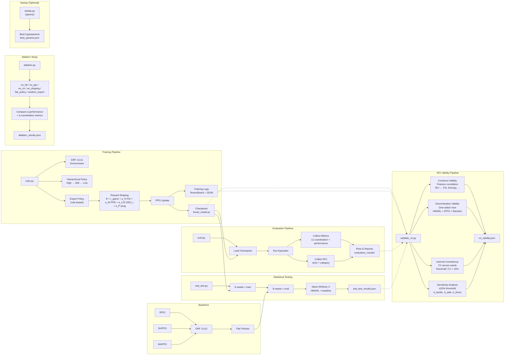

# HMARL-GRF

Hierarchical Multi-Agent Reinforcement Learning for Google Research Football.

Implements a three-level hierarchical RL architecture (High-Level → Mid-Level → Low-Level PPO) with novel Role Coherence Index (RCI) metric, plus three flat baselines (IPPO, SHPPO, MAPPO) for comparison.

## Project Structure

```
hmarl-grf/
├── hmarl/                        # Core package
│   ├── __init__.py
│   ├── env.py                    # GRF environment wrapper + state extraction
│   ├── utils.py                  # Shared utilities (seed, obs extraction, checkpointing, progress)
│   ├── policy.py                 # Hierarchical policy (High/Mid/Low-level)
│   ├── expert.py                 # Rule-based expert policy (RCI oracle)
│   ├── reward.py                 # Reward shaping (FAI, PPR, RCI, Ball Progression)
│   ├── rci.py                    # Role Coherence Index metric
│   ├── metrics.py                # Evaluation metrics suite
│   ├── ippo.py                   # Independent PPO baseline
│   ├── shppo.py                  # Shared PPO baseline (pooled experience)
│   └── mappo.py                  # MAPPO baseline (centralized critic)
├── scripts/
│   ├── train.py                  # HMARL training + checkpoint + mid-train eval
│   ├── eval.py                   # HMARL evaluation + visualization
│   ├── dry_run.py                # Dry run / smoke test (3-layer validation)
│   ├── sweep.py                  # Optuna hyperparameter sweep
│   ├── stat_test.py              # Multi-seed statistical significance testing
│   ├── validate_rci.py              # RCI validity evaluation (construct, discrimination, consistency)
│   └── ablation.py               # Ablation study (component contributions)
├── evaluation/
│   ├── baselines/                # Stable Baselines3 baselines
│   │   ├── 11v11_a2c.py
│   │   ├── 11v11_ppo.py
│   │   └── 11v11_random_action.py
│   ├── visualizations.py         # Plotting utilities (16 plot types, colorblind-safe)
│   ├── coordination_metrics.py   # Coordination metric computation
│   ├── plot_results.py           # Plot generation CLI (--demo mode)
│   └── average_position.py       # Average position analysis
├── dumps/                        # Episode dumps, replay, TensorBoard logs
│   ├── dump_to_txt.py
│   ├── dump_to_video.py
│   ├── convert_txt_to_json.py
│   └── replay.py
├── setup.py
└── README.md
```

## Research Workflow

Standard RL research pipeline — all paths relative to project root.



### Research Execution Priority

Scripts categorized by whether they're required for thesis results. **Run Tier 1 first; Tier 2 depends on Tier 1 checkpoints.**

| Tier | Script | Purpose | Research Problem | Skip? |
|------|--------|---------|-----------------|-------|
| **0** | `dry_run.py --full` | Smoke test: syntax, imports, GRF env, PPO backward | — | 5 min, do once before any training |
| **1** | `train.py` | Train HMARL (3M timesteps → checkpoint) | Foundation for all eval | No — produces `hmarl_model.pt` |
| **1** | `hmarl.ippo` / `hmarl.shppo` / `hmarl.mappo` | Train flat baselines | Need trained baselines for comparison | No — produces `*_model.pt` |
| **2** | `eval.py` | Full metrics + 16 plot types | All coordination + performance results | No |
| **2** | `ablation.py` | Component ablation (7 configs) | Rumusan 1: proving each component matters | No — `--quick` for first pass |
| **2** | `stat_test.py` | Multi-seed Mann-Whitney U | Statistical rigor for comparative claims | No — `--quick` for first pass |
| **2** | `validate_rci.py` | RCI construct + discrimination + consistency | Rumusan 2: RCI validity | No — needs `stat_test` results or `--seeds` |
| **3** | `sweep.py` | Optuna hyperparameter search | Optional optimization | **Yes** — hyperparams set via grid search already |
| **—** | `plot_results.py` | Regenerate plots from saved JSONs | Useful if `eval.py` plots need re-rendering | Optional, not research output |

**Minimum viable path for thesis results:**

```bash
# 1. Verify environment
docker compose up -d && docker exec -it gfootball-dev bash
python scripts/dry_run.py --full

# 2. Train (HMARL + baselines) — several days on GTX 1650
python scripts/train.py --timesteps 3000000
python -m hmarl.ippo --timesteps 3000000 --seed 42
python -m hmarl.shppo --timesteps 3000000 --seed 42
python -m hmarl.mappo --timesteps 3000000 --seed 42

# 3. Full evaluation (metrics + plots)
python scripts/eval.py --checkpoint checkpoints/hmarl_model.pt

# 4. Ablation (quick first, then full)
python scripts/ablation.py --quick
python scripts/ablation.py --timesteps 300000 --eval-episodes 50

# 5. Statistical testing (quick first, then full)
python scripts/stat_test.py --quick
python scripts/stat_test.py --seeds 5 --timesteps 3000000 --eval-episodes 100

# 6. RCI validity
python scripts/validate_rci.py --quick
python scripts/validate_rci.py --seeds 3 --timesteps 3000000 --eval-episodes 100
```

**Estimated compute time (GTX 1650, WSL):** 3–5 days per 3M-step training run. Ablation (7 configs × 300k) ≈ 1–2 days. Stat test (5 seeds × 4 algos × 3M) ≈ 2–3 weeks if sequential; overlap training to reduce wall time.

### Script → Module Dependency Matrix

| Script | utils | env | policy | expert | reward | rci | metrics |
|--------|:-----:|:---:|:------:|:------:|:------:|:---:|:-------:|
| `scripts/train.py` | ✅ | ✅ | ✅ | ✅ | ✅ | ✅ | ✅ |
| `scripts/eval.py` | ✅ | ✅ | ✅ | — | — | — | ✅ |
| `scripts/sweep.py` | ✅ | — | — | — | — | — | — |
| `scripts/stat_test.py` | ✅ | — | — | — | — | — | ✅ |
| `scripts/validate_rci.py` | ✅ | — | — | — | — | — | — |
| `scripts/ablation.py` | ✅ | ✅ | ✅ | ✅ | ✅ | ✅ | ✅ |
| `hmarl/ippo.py` | — | ✅ | — | — | — | — | — |
| `hmarl/shppo.py` | — | ✅ | — | — | — | — | — |
| `hmarl/mappo.py` | — | ✅ | — | — | — | — | — |

`sweep.py` and `stat_test.py` orchestrate training/eval as subprocesses — minimal hmarl imports (shared utilities only).

## Algorithms

### HMARL (Proposed Method)

Three-level hierarchical architecture:
- **High-Level** (π^H): Rule-based — global state → macro strategy (High Pressing / Counter Attack / Possession Play)
- **Mid-Level** (π^M): Rule-based — (role, macro strategy, local state) → sub-goal (Zonal Marking / Build-up / Wing Attack / Man Marking / Clearance)
- **Low-Level** (π^L): PPO-trained neural network — (observation, sub-goal embedding) → action

Combined reward: `R_t = r_game + α_H·FAI + α_M·PPR + (α_L/N)·Σ RCI_i + α_P·prog(t)`

### Baselines

| Algorithm | Actor | Critic | Experience | Reference |
|-----------|-------|--------|------------|-----------|
| **IPPO** | Shared (115-dim local obs) | Local (115-dim) | Per-agent, reward split evenly | Song et al. (2024) |
| **SHPPO** | Shared (115-dim local obs) | Local (115-dim) | Pooled, full team reward | Song et al. (2024) |
| **MAPPO** | Shared (115-dim local obs) | Centralized (1265-dim) | Pooled, full team reward | Yu et al. (2022) |

**Key differences:**
- **IPPO**: each agent's transition tracked independently; team reward divided equally (`r / 11`)
- **SHPPO**: all agents' transitions pooled into one buffer; full team reward assigned to every agent
- **MAPPO**: decentralized actors + centralized critic that sees concatenated observations of all 11 agents (11 × 115 = 1265-dim)

### Fairness Note

| Aspect | HMARL | IPPO | SHPPO | MAPPO |
|--------|-------|------|-------|-------|
| Learning rate | 3e-4 | 3e-4 | 3e-4 | 3e-4 |
| Discount (γ) | 0.99 | 0.99 | 0.99 | 0.99 |
| GAE lambda | 0.95 | 0.95 | 0.95 | 0.95 |
| Clip range | 0.2 | 0.2 | 0.2 | 0.2 |
| Entropy coeff | 0.01 | 0.01 | 0.01 | 0.01 |
| Value loss coeff | 0.5 | 0.5 | 0.5 | 0.5 |
| Minibatch size | 64 | 64 | 64 | 64 |
| PPO epochs | 4 | 4 | 4 | 4 |
| Total timesteps | 3M | 3M | 3M | 3M |
| Hidden dim | 256 | 256 | 256 | 256 |
| Network depth | 2 hidden | 2 hidden | 2 hidden | 2 hidden (actor + critic) |
| Optimizer | Adam (ε=1e-5) | Adam | Adam | Adam |
| Grad clip | 0.5 | 0.5 | 0.5 | 0.5 |
| Env representation | raw | raw | raw | raw |
| **Reward signal** | **r_game + FAI + PPR + RCI + prog** | r_game only | r_game only | r_game only |
| Seed support | ✅ | ✅ | ✅ | ✅ |
| CLI resume | ✅ | ✅ | ✅ | ✅ |
| Mid-train eval | ✅ | ✅ | ✅ | ✅ |

**Reward shaping difference (intentional):** HMARL uses hierarchical reward shaping (FAI, PPR, RCI, Ball Progression) while baselines use game reward only. This is a deliberate design choice: baselines represent standard flat RL without domain-specific reward engineering. HMARL's improvement over baselines is attributed to the combination of hierarchical architecture AND reward shaping. The ablation study (`scripts/ablation.py`) isolates each component's contribution.

## Environment

Google Research Football (`11_vs_11_stochastic`), 11 controlled agents, 19 discrete actions.

Two observation modes:
- `raw` — dict per agent (used by HMARL, IPPO, SHPPO, MAPPO for full state access)
- `simple115v2` — 115-dim vector per agent (used by Stable Baselines3 baselines)

## Requirements

**Core (required):**
- Python 3.6+
- PyTorch
- NumPy
- Google Research Football (Docker only)

**Baselines:**
- Stable Baselines3 (for `evaluation/baselines/` scripts)

**Optional (for advanced analysis):**
- `optuna` — hyperparameter sweep (`scripts/sweep.py`)
- `scipy` — statistical significance tests (`scripts/stat_test.py`)

## Setup

### Google Research Football (GRF) Installation

GRF requires building from source — it has no pre-built packages for Windows. Docker is the supported approach.

**Option A: Docker (recommended)**

```bash
# 1. Clone GRF into a temporary directory (needed for Docker build)
git clone https://github.com/google-research/football.git /tmp/grf

# 2. Copy GRF source into this project (Dockerfile expects it at project root)
cp -r /tmp/grf/. .

# 3. Build and start the container (installs GRF + dependencies)
docker compose up -d

# 4. Enter the container
docker exec -it gfootball-dev bash

# 5. Install this package (inside container)
cd /gfootball
pip install -e .

# 6. Optional: install analysis tools
pip install optuna scipy
```

**Option B: Native (Linux only, no Docker)**

```bash
# 1. Install system dependencies
sudo apt-get install -y git cmake build-essential \
    libgl1-mesa-dev libsdl2-dev libsdl2-image-dev \
    libsdl2-ttf-dev libsdl2-gfx-dev libboost-all-dev \
    libdirectfb-dev

# 2. Clone and build GRF
git clone https://github.com/google-research/football.git
cd football
pip install .
cd ..

# 3. Install this package
pip install -e .
```

**Note:** GRF does not support native Windows installation. Windows users must use Docker. WSL2 + Docker Desktop is the recommended path.

## Training

### HMARL (Proposed)

```bash
python scripts/train.py --timesteps 3000000

# With custom seed for reproducibility
python scripts/train.py --timesteps 3000000 --seed 123

# Resume from checkpoint
python scripts/train.py --resume checkpoints/hmarl_model.pt

# Custom log/checkpoint directory
python scripts/train.py --log-dir my_logs --model-dir my_checkpoints

# Selective dump: save episode dumps every 500 episodes (keeps max 10)
python scripts/train.py --dump-freq 500 --max-dumps 10

# Dump more frequently for presentation material
python scripts/train.py --dump-freq 100 --max-dumps 20

# Disable dumps entirely
python scripts/train.py --dump-freq 0
```

**Mid-training evaluation:** Automatically runs 10-episode evaluation every 500 episodes, logging win rate, avg reward, and goal difference to TensorBoard.

**Training log:** Per-episode metrics saved to `dumps/training_log.json` (rewards, RCI, FAI, PPR, compactness, ball progression, action distribution).

## TensorBoard Monitoring

TensorBoard logs are written to `dumps/hmarl_runs/` by `train.py`.

**Logged metrics:**

| Tag | Frequency | Description |
|-----|-----------|-------------|
| `loss/policy` | Per PPO update | Clipped surrogate policy loss |
| `loss/value` | Per PPO update | Value function MSE loss |
| `loss/entropy` | Per PPO update | Policy entropy bonus |
| `reward/episode` | Per episode | Cumulative reward per episode |
| `reward/avg_100` | Per episode | Rolling 100-episode average reward |
| `training/episode_length` | Per episode | Timesteps per episode |
| `eval/win_rate` | Every 500 episodes | Win rate during mid-training eval |
| `eval/avg_reward` | Every 500 episodes | Average reward during mid-training eval |
| `eval/goal_diff` | Every 500 episodes | Goal difference during mid-training eval |
| `metrics/rci_cat` | Every 50 episodes | Rolling RCI_cat average |
| `metrics/rci_strict` | Every 50 episodes | Rolling RCI_strict average |
| `metrics/fai` | Every 50 episodes | Rolling FAI average |
| `metrics/ppr` | Every 50 episodes | Rolling PPR average |
| `metrics/compactness` | Every 50 episodes | Rolling compactness average |

**Access from host:**
```bash
pip install tensorboard
cd C:/1_projects/UGM/tesis/proposal/Source Code/hmarl-grf
tensorboard --logdir=dumps/hmarl_runs
# Open http://localhost:6006
```

**Access from container:**
```bash
docker exec -it gfootball-dev bash
tensorboard --logdir=/gfootball/dumps/hmarl_runs --host=0.0.0.0
# Open http://localhost:6006
```

Note: If `tensorboard` is not installed on the host, use the container method. The `dumps/` directory is bind-mounted, so logs written inside the container are accessible from both host and container.

**Episode dumps:** GRF can write full episode dumps (`.dump` files) for replay and visualization. These are large (~12MB per episode), so training uses **selective dumping** — dumps are only written at specific intervals and auto-cleaned to keep storage bounded. See [Episode Dumps](#episode-dumps) for details.

### Baselines

```bash
# IPPO (per-agent independent PPO)
python -m hmarl.ippo --timesteps 3000000 --seed 42

# SHPPO (shared network, pooled experience)
python -m hmarl.shppo --timesteps 3000000 --seed 42

# MAPPO (decentralized actors + centralized critic)
python -m hmarl.mappo --timesteps 3000000 --seed 42

# Resume from checkpoint
python -m hmarl.ippo --resume dumps/ippo_model.pt
python -m hmarl.shppo --resume dumps/shppo_model.pt
python -m hmarl.mappo --resume dumps/mappo_model.pt
```

All baselines support `--seed` and `--resume` flags (same as HMARL).

## Evaluation

```bash
# Evaluate HMARL + random baseline
python scripts/eval.py --checkpoint checkpoints/hmarl_model.pt --baseline all

# Evaluate HMARL only (100 episodes)
python scripts/eval.py --checkpoint checkpoints/hmarl_model.pt --episodes 100

# With rendering
python scripts/eval.py --checkpoint checkpoints/hmarl_model.pt --render
```

**Checkpoint metadata:** When loading a checkpoint, `eval.py` displays reproducibility info: git hash, training hyperparameters, Python/Torch versions, and training timestamp (saved by `train.py` since the refactoring).

**Metrics computed:**
- **Performance**: Win Rate, Goal Difference, Cumulative Reward
- **Coordination**: PSR, PPR, Positional Entropy, Team Compactness, FAI
- **Role Coherence**: RCI_strict (exact match), RCI_cat (category match)
- **Action Analysis**: Action distribution, entropy, dominant action % (mode collapse detection)

**Output files:**
- `evaluation_results/hmarl_results.json` — aggregate metrics + action distribution
- `evaluation_results/hmarl_episodes.json` — per-episode breakdown
- `evaluation_results/reward_components.json` — per-episode reward breakdown (game, FAI, PPR, RCI, progression)
- `evaluation_results/plots/` — role heatmap, formation snapshots, action distribution, strategy timeline, compactness plot

## Dry Run (Smoke Test)

Three-layer validation to catch issues before full training runs.

| Layer | What it tests | Needs Docker? |
|-------|---------------|---------------|
| 1 | AST syntax check on all `.py` files | No |
| 2 | Import all modules + unit tests (policy, reward, metrics, buffer) | Yes |
| 2c | Script unit tests (eval, validate_rci, stat_test, ablation, sweep) | Yes |
| 3 | Full GRF integration: 1 episode, 50 steps, PPO backward pass | Yes |

```bash
# Quick: AST + components + mock pipeline (no GRF env)
python scripts/dry_run.py

# Full: includes actual GRF environment (50 steps)
python scripts/dry_run.py --full

# Host-only: syntax check only (no imports, no Docker)
python scripts/dry_run.py --ast-only
```

**What it verifies:**
- All `.py` files parse without syntax errors
- All `hmarl.*` modules import successfully
- Policy forward/backward pass with correct shapes
- Observation vector extraction (115-dim)
- High/Mid-level policy logic (strategy + sub-goal)
- Expert policy ideal actions per role
- Reward computation (FAI + PPR + RCI + Ball Progression)
- Rollout buffer (add, GAE, mini-batch)
- Action category mapping
- Mock training loop: 50 steps, full PPO update
- Script function tests: eval obs extraction, validate_rci correlation/t-test/CV, stat_test Mann-Whitney U, ablation reward factory, sweep optuna availability

**Example output:**
```
=== Layer 1: AST Syntax Check ===
  All .py files parse OK

=== Layer 2: Component Unit Tests ===
  PASS  import all modules
  PASS  set_seed
  PASS  policy forward pass
  PASS  policy backward pass
  PASS  extract_obs_vector
  PASS  extract_game_state
  PASS  high-level policy
  PASS  mid-level policy
  PASS  expert policy
  PASS  reward computation
  PASS  FAI computation
  PASS  RCI computation
  PASS  metrics
  PASS  team_compactness
  PASS  formation_adherence_index (metric)
  PASS  rollout buffer
  PASS  action category

=== Layer 2b: Mock Pipeline (1 episode, 50 steps) ===
    step 10/50 reward=0.342
    step 20/50 reward=0.891
    step 30/50 reward=1.456
    step 40/50 reward=2.012
    step 50/50 reward=2.678
  PASS  PPO backward update (mock pipeline)
  Mock pipeline: 50 steps in 1.23s (41 steps/s)

=== Layer 2c: Script Unit Tests ===
  PASS  eval._extract_dict_from_simple
  PASS  eval.get_obs_vector
  PASS  validate_rci.construct_validity
  PASS  validate_rci.discrimination_validity
  PASS  validate_rci.internal_consistency
  PASS  validate_rci.run_full_validation
  PASS  stat_test.run_statistical_test
  PASS  sweep imports
  PASS  ablation.make_custom_reward
  PASS  ablation.ABLATION_CONFIGS

=== Layer 3: GRF Integration (1 episode, 50 steps) ===
  PASS  env.reset + extract_game_state
  PASS  env.step full loop (50 steps)
  PASS  GRF PPO backward (10 steps)

============================================================
  ALL 30 CHECKS PASSED
============================================================
```

## Plot Generation

Generate all 16 thesis plots from saved evaluation results, or with synthetic data for visual verification.

```bash
# Demo mode: generate all plots with synthetic data (no training needed)
python evaluation/plot_results.py --demo --output-dir plots_output

# From real evaluation results
python evaluation/plot_results.py --results-dir evaluation_results --output-dir evaluation_results/plots

# Docker
docker exec gfootball-dev bash -c "cd /app && python3 evaluation/plot_results.py --demo --output-dir /app/evaluation_results/plots"
docker cp gfootball-dev:/app/evaluation_results/plots/ ./plots_output/
```

**16 plot types:**

| # | Plot | File | Description |
|---|------|------|-------------|
| 1 | Learning Curve | `01_learning_curve.png` | Cumulative reward vs episode (rolling mean ± std band) |
| 2 | RCI Evolution | `02_rci_evolution.png` | RCI_cat (a) and RCI_strict (b) over training — two-panel with subplot labels |
| 3 | Comparative Bars | `03_comparative_metrics.png` | Two-panel: (a) Performance, (b) Coordination (normalized to [0,1]) |
| 4 | Role Heatmap | `04_role_heatmap.png` | 2D position frequency per role on pitch (hot colormap) |
| 5 | Formation Snapshot | `05_formation_*.png` | Agent positions at specific timestep (start/mid/late) |
| 6 | Action Distribution | `06_action_distribution.png` | Stacked bar: action category per role |
| 7 | Strategy Timeline | `07_strategy_timeline.png` | Macro strategy activation over match (single or multi-episode) |
| 8 | Compactness | `08_compactness.png` | Team compactness ρ_tc over time (multi-episode: mean ± std) |
| 9 | Ablation Study | `09_ablation.png` | Horizontal bars sorted by value, Full HMARL highlighted, reference line |
| 10 | Tactic Transitions | `10_tactic_transitions.png` | Sub-goal frequency stacked area (single or multi-episode) |
| 11 | Reward Breakdown | `11_reward_breakdown.png` | Reward component contribution over training |
| 12 | Correlation Heatmap | `12_correlation_heatmap.png` | Pearson r between coordination metrics |
| 13 | Pass Network | `13_pass_network.png` | Weighted directed graph of pass connections between players |
| 14 | Inter-Agent Distance | `14_iad_per_line.png` | Bar chart: gaps between defence/midfield/attack lines |
| 15 | Convex Hull | `15_convex_hull_ts.png` | Convex hull area over match duration |
| 16 | Action Transitions | `16_action_transitions.png` | Action-to-action transition probability heatmap (viridis) |

**Plot design:**
- **Colorblind-safe palette**: Wong (2011) — all 5 methods distinguishable by color, linestyle, AND marker (triple encoding)
- **Stable mapping**: HMARL = blue, SHPPO = vermillion, MAPPO = pink, IPPO = green, Random = gray — consistent across all figures
- **Subplot labels**: Multi-panel figures use (a), (b) labels for thesis cross-referencing
- **No figure titles**: Thesis convention — `\caption{}` serves as title
- **300 DPI**, serif font, Computer Modern math rendering, no seaborn dependency

## Hyperparameter Sweep

Searches over 8 hyperparameters using Optuna TPE sampler with median pruner.

**Search space:**

| Parameter | Range |
|-----------|-------|
| Learning rate | 1e-5 — 1e-2 (log) |
| Discount (γ) | 0.95 — 0.999 |
| GAE lambda (λ) | 0.8 — 0.99 |
| Clip range (ε) | 0.1 — 0.3 |
| Entropy coeff | 1e-4 — 0.1 (log) |
| Value loss coeff | 0.25 — 1.0 |
| Minibatch size | {32, 64, 128} |
| PPO epochs | 2 — 8 |

```bash
# 50 trials, 500k steps each
python scripts/sweep.py --trials 50 --timesteps 500000

# Quick scan
python scripts/sweep.py --trials 20 --timesteps 100000

# Custom output path
python scripts/sweep.py --output my_sweep/best.json
```

**Output:** `sweep_results/best_params.json`

**Temp cleanup:** `sweep_temp/` directory cleaned up after completion.

## Statistical Significance Testing

Runs each algorithm over N random seeds, computes mean ± std, and performs Mann-Whitney U test (one-sided: HMARL > baseline, α = 0.05).

```bash
# Full: 5 seeds, 3M steps, 100 eval episodes
python scripts/stat_test.py --seeds 5 --timesteps 3000000 --eval-episodes 100

# Quick: 3 seeds, 100k steps, 10 eval episodes
python scripts/stat_test.py --quick

# Test specific algorithms
python scripts/stat_test.py --algorithms hmarl ippo shppo mappo random

# Custom base seed
python scripts/stat_test.py --seeds 5 --base-seed 100
```

**Output:** `evaluation_results/stat_test_results.json`

**Flat baseline metrics:** All algorithms (including IPPO, SHPPO, MAPPO, Random) now compute the full metrics suite (RCI, PSR, PPR, FAI, compactness, entropy, etc.) — not just win rate and reward. This enables apple-to-apple comparison across all metrics.

**Progress tracking:** Displays live progress bar with ETA during seed loops and episode evaluation.

**Temp cleanup:** Temporary directories (`stat_temp/`) are automatically cleaned up after completion.

**Statistical tests performed:**
- Mann-Whitney U test (one-sided, HMARL > each baseline)
- Reports: U-statistic, p-value, significance (p < 0.05)
- Gracefully skips if scipy not installed

## RCI Validity Evaluation

Evaluates Role Coherence Index (RCI) through three validity approaches matching the thesis methodology (BAB IV §Validitas Metrik RCI):

1. **Construct Validity** — Pearson correlation between RCI and established metrics (FAI, Entropy, Compactness, PSR, PPR) with p-values
2. **Discrimination Validity** — One-sided t-test: HMARL RCI > IPPO RCI > Random RCI (α = 0.05)
3. **Internal Consistency** — Coefficient of Variation (CV) across seeds; CV < 15% = acceptable
4. **Sensitivity Analysis** (optional) — RCI stability under expert policy threshold variations (±20% on d_tackle, d_safe, d_shoot)

```bash
# Full: 3 seeds, 3M steps, 100 eval episodes
python scripts/validate_rci.py --seeds 3 --timesteps 3000000 --eval-episodes 100

# Quick: 3 seeds, 100k steps, 10 eval episodes
python scripts/validate_rci.py --quick

# Load existing stat_test results (seed-level aggregates only)
python scripts/validate_rci.py --load-results evaluation_results/stat_test_results.json

# Include sensitivity analysis (requires trained model checkpoint)
python scripts/validate_rci.py --sensitivity --model-path dumps/hmarl_model.pt

# Test specific algorithms
python scripts/validate_rci.py --algorithms hmarl ippo shppo random
```

**Output:** `evaluation_results/rci_validity.json`

**Error handling:** Full tracebacks on failure (not just error messages). Imports consolidated to `hmarl.utils` (no more cross-script circular imports). Format string safety for missing metrics. Handles skipped tests (e.g., insufficient seeds) without KeyError.

**Dependencies:** `scipy` (for t-test and Pearson correlation). Skips gracefully if not installed.

**Correlation pairs tested:**
- RCI_cat ↔ FAI (expected: positive)
- RCI_strict ↔ FAI (expected: positive)
- RCI_cat ↔ Positional Entropy (expected: negative)
- RCI_strict ↔ Positional Entropy (expected: negative)
- RCI_cat ↔ Compactness (expected: negative)
- RCI_cat ↔ PSR/PPR/Win Rate (expected: positive)

## Ablation Study

Tests contribution of each component by systematically removing them:

| Config | Description | What changes |
|--------|-------------|--------------|
| `full_hmarl` | Full HMARL (baseline) | Nothing — all components active |
| `no_fai` | Without FAI reward | α_H = 0, no formation adherence signal |
| `no_ppr` | Without PPR reward | α_M = 0, no progressive pass signal |
| `no_rci` | Without RCI reward | α_L = 0, no role coherence signal |
| `no_reward_shaping` | Game reward only | All α = 0, pure game reward |
| `flat_policy` | Flat policy | Sub-goal embedding zeroed out, no hierarchical conditioning |
| `random_expert` | Random expert | Ideal actions random instead of rule-based |

```bash
# Full ablation (all 7 configs)
python scripts/ablation.py --timesteps 300000 --eval-episodes 50

# Quick mode (100k steps, 20 eval episodes)
python scripts/ablation.py --quick

# Run specific configs only
python scripts/ablation.py --configs full_hmarl no_fai no_rci

# Custom seed
python scripts/ablation.py --seed 123 --timesteps 500000
```

**Output:** `evaluation_results/ablation_results.json`

**Progress tracking:** Live progress bar with ETA for the 7-config loop. Error tracebacks on failure.

**Temp cleanup:** `ablation_temp/` directory cleaned up after completion.

**Summary table example:**
```
  Config                     Win Rate   Avg Reward   Goal Diff
  ---------------------------------------------------------
  full_hmarl                   45.0%        12.34          5
  no_fai                       38.0%        10.21          2  (-7.0%)
  no_ppr                       40.0%        11.05          3  (-5.0%)
  no_rci                       35.0%         9.87          0  (-10.0%)
  no_reward_shaping            30.0%         8.45         -2  (-15.0%)
  flat_policy                  25.0%         7.12         -5  (-20.0%)
  random_expert                42.0%        11.50          4  (-3.0%)
```

## Hyperparameters

| Parameter | Value |
|-----------|-------|
| Learning rate | 3e-4 |
| Discount (γ) | 0.99 |
| GAE lambda (λ) | 0.95 |
| Clip range (ε) | 0.2 |
| Entropy coeff (c2) | 0.01 |
| Value loss coeff (c1) | 0.5 |
| Minibatch size | 64 |
| PPO epochs per update | 4 |
| Total timesteps | 3,000,000 |
| Max episode steps | 3,000 |
| Hidden dim | 256 |
| Head dim | 128 |
| Sub-goal embedding dim | 16 |
| Random seed | 42 (default) |

## Reward Shaping Coefficients

| Coefficient | Component | Value | Description |
|-------------|-----------|-------|-------------|
| α_H | Formation Adherence Index (FAI) | 0.1 | High-level formation adherence signal |
| α_M | Progressive Pass Ratio (PPR) | 0.1 | Mid-level progressive passing signal |
| α_L | Role Coherence Index (RCI) | 0.05 | Low-level role coherence signal |
| α_P | Ball Progression | 0.2 | Dense forward-progress reward |

**Rationale:** Coefficients are scaled so that shaping terms contribute ~0.1–0.3 per step (meaningful gradient signal), while the game reward contributes ~-5 to -10 per step (sparse, only on goals). The ball progression term (α_P = 0.2) provides the strongest dense signal to prevent the agent from collapsing into inaction when no goals are scored.

## CLI Reference

### Shared Utilities (`hmarl/utils.py`)

Central module eliminating code duplication across scripts. All scripts import from this module instead of defining local copies.

| Export | Description |
|--------|-------------|
| `set_seed(seed)` | Set random seeds (Python, NumPy, PyTorch) |
| `extract_obs_vector(gs, idx, obs_dim=115)` | Extract fixed-length observation vector from GRF game state |
| `load_hmarl_checkpoint(path, device)` | Load policy + subgoal_embedding + metadata from checkpoint |
| `save_checkpoint(path, ...)` | Save checkpoint with reproducibility metadata (git hash, hyperparams, timestamps) |
| `ProgressTracker(total, label)` | Live progress bar + ETA for loops |
| `cleanup_temp_dirs(dirs)` | Remove temporary directories (`stat_temp/`, `ablation_temp/`, etc.) |
| `get_git_hash()` | Best-effort git commit hash |
| `OBS_DIM`, `HIDDEN_DIM`, `HEAD_DIM`, `ACTION_SPACE_SIZE`, `EPISODE_MAX_STEPS` | Shared constants (single source of truth) |

### Reproducibility Metadata

Checkpoints saved by `train.py` include:
- `git_hash` — commit hash at training time
- `python_version`, `torch_version` — runtime environment
- `save_timestamp` — when the checkpoint was saved
- `hyperparams` — all PPO hyperparameters used for training

This metadata is displayed by `eval.py` when loading a checkpoint and stored in the JSON output.

### train.py

```
--timesteps INT     Total training timesteps (default: 3,000,000)
--eval-freq INT     Evaluation frequency in episodes (default: 10,000)
--seed INT          Random seed (default: 42)
--resume PATH       Resume from checkpoint
--render            Render during training
--log-dir PATH      Log directory (default: dumps)
--model-dir PATH    Checkpoint directory (default: checkpoints)
--dump-freq INT     Enable dump every N episodes (default: 500, 0=never)
--max-dumps INT     Max dump files to keep (default: 10)
```

### eval.py

```
--checkpoint PATH   Model checkpoint path (required)
--episodes INT      Number of evaluation episodes (default: 100)
--output-dir PATH   Output directory (default: evaluation_results)
--render            Render during evaluation
--baseline STR      Also eval baselines: "random" or "all"
```

### sweep.py

```
--trials INT        Number of Optuna trials (default: 50)
--timesteps INT     Training steps per trial (default: 500,000)
--eval-episodes INT Eval episodes per trial (default: 20)
--seed INT          Base seed (default: 42)
--study-name STR    Optuna study name (default: hmarl_sweep)
--output PATH       Output JSON path
```

### stat_test.py

```
--seeds INT         Number of random seeds (default: 5)
--timesteps INT     Training steps per seed (default: 3,000,000)
--eval-episodes INT Eval episodes per seed (default: 100)
--base-seed INT     Starting seed (default: 42)
--algorithms LIST   Algorithms to test (default: hmarl random)
--output PATH       Output JSON path
--quick             Quick mode: 100k steps, 10 eval, 3 seeds
```

### ablation.py

```
--timesteps INT     Training steps per config (default: 300,000)
--eval-episodes INT Eval episodes per config (default: 50)
--seed INT          Random seed (default: 42)
--configs LIST      Specific configs to run (default: all 8)
--output PATH       Output JSON path
--quick             Quick mode: 100k steps, 20 eval episodes
```

## Episode Dumps

GRF's `write_full_episode_dumps=True` writes a `.dump` file (~12MB) for **every episode**. With 3M timesteps (~6,000 episodes), that's ~72GB — impractical for storage.

**Strategy: selective dump + auto-cleanup**

| Constant | Default | Effect |
|----------|---------|--------|
| `DUMP_FREQ` | 500 | Enable dump every N episodes |
| `MAX_DUMPS` | 10 | Keep at most N most recent dump files |

During training:
1. Normal episodes → `write_full_episode_dumps=False` (no disk write)
2. Every `DUMP_FREQ` episodes → env recreated with `write_full_episode_dumps=True` for 1 episode
3. After the dump episode → env reverts to `False`, old dumps beyond `MAX_DUMPS` are deleted

**Storage estimate:**
- 10 dumps × ~12MB = **~120MB** (stable, does not grow with training)
vs
- Without selective dump: 6,000 episodes × ~12MB = **~72GB**

**Replay & visualization:**
```bash
# Replay a dump file
python dumps/replay.py --trace_file dumps/episode_done_XXXX.dump

# Convert dump to JSON for analysis
python dumps/convert_txt_to_json.py dumps/episode_done_XXXX.dump output.json
```

## License

Internal research use only.
