# HMARL-GRF

Hierarchical Multi-Agent Reinforcement Learning for Google Research Football.

Implements a three-level hierarchical RL architecture (High-Level → Mid-Level → Low-Level PPO) with novel Role Coherence Index (RCI) metric, plus three flat baselines (IPPO, SHPPO, MAPPO) for comparison.

## Project Structure

```
hmarl-grf/
├── hmarl/                        # Core package
│   ├── __init__.py
│   ├── env.py                    # GRF environment wrapper + state extraction
│   ├── policy.py                 # Hierarchical policy (High/Mid/Low-level)
│   ├── expert.py                 # Rule-based expert policy (RCI oracle)
│   ├── reward.py                 # Reward shaping (FAI, PPR, RCI components)
│   ├── rci.py                    # Role Coherence Index metric
│   ├── metrics.py                # Evaluation metrics suite
│   ├── ippo.py                   # Independent PPO baseline
│   ├── shppo.py                  # Shared PPO baseline (pooled experience)
│   └── mappo.py                  # MAPPO baseline (centralized critic)
├── scripts/
│   ├── train.py                  # HMARL training + checkpoint + mid-train eval
│   ├── eval.py                   # HMARL evaluation + visualization
│   ├── sweep.py                  # Optuna hyperparameter sweep
│   ├── stat_test.py              # Multi-seed statistical significance testing
│   └── ablation.py               # Ablation study (component contributions)
├── evaluation/
│   ├── baselines/                # Stable Baselines3 baselines
│   │   ├── 11v11_a2c.py
│   │   ├── 11v11_ppo.py
│   │   └── 11v11_random_action.py
│   ├── visualizations.py         # Plotting utilities (12 plot types)
│   ├── coordination_metrics.py   # Coordination metric computation
│   ├── plot_results.py           # Plot generation CLI (--demo mode)
│   └── average_position.py       # Average position analysis
├── dumps/                        # Episode dumps, replay, TensorBoard logs
│   ├── dump_to_txt.py
│   ├── dump_to_video.py
│   ├── convert_txt_to_json.py
│   └── replay.py
├── setup.py
└── README.md
```

## Research Workflow

Standard RL research pipeline — all paths relative to project root.

```mermaid
flowchart TD
    subgraph Entry["Entry Points (CLI)"]
        T["scripts/train.py<br/>HMARL training"]
        E["scripts/eval.py<br/>Evaluation + visualization"]
        SW["scripts/sweep.py<br/>Optuna hyperparameter sweep"]
        ST["scripts/stat_test.py<br/>Multi-seed statistical testing"]
        AB["scripts/ablation.py<br/>Ablation study"]
    end

    subgraph Core["Core Package (hmarl/)"]
        ENV["env.py<br/>GRF environment wrapper<br/>+ state extraction"]
        POL["policy.py<br/>Hierarchical policy<br/>High/Mid/Low-level"]
        EXP["expert.py<br/>Rule-based expert<br/>(RCI oracle)"]
        RW["reward.py<br/>Reward shaping<br/>FAI + PPR + RCI"]
        RCI["rci.py<br/>Role Coherence<br/>Index metric"]
        MET["metrics.py<br/>Evaluation metrics<br/>(12 metrics)"]
    end

    subgraph Baselines["Baselines"]
        IPPO["hmarl/ippo.py<br/>Independent PPO"]
        SHPPO["hmarl/shppo.py<br/>Shared PPO"]
        MAPPO["hmarl/mappo.py<br/>MAPPO"]
        SB3_A2C["baselines/11v11_a2c.py<br/>(Stable Baselines3)"]
        SB3_PPO["baselines/11v11_ppo.py<br/>(Stable Baselines3)"]
        SB3_RAND["baselines/11v11_random_action.py"]
    end

    subgraph GRF["Google Research Football"]
        GENV["gfootball.env<br/>11_vs_11_stochastic"]
    end

    subgraph Outputs["Artifacts"]
        CKPT["checkpoints/<br/>hmarl_model.pt"]
        DUMPS["dumps/<br/>episode .dump files<br/>+ training_log.json"]
        TB["dumps/hmarl_runs/<br/>TensorBoard logs"]
        ER["evaluation_results/<br/>*.json + plots/"]
        SR["sweep_results/<br/>best_params.json"]
    end

    subgraph DumpUtils["Dump Utilities"]
        REPLAY["dumps/replay.py<br/>Replay .dump files"]
        CONV["dumps/convert_txt_to_json.py<br/>Dump → JSON"]
    end

    %% Training flow
    T --> ENV
    T --> POL
    T --> EXP
    T --> RW
    T --> RCI
    T --> MET
    ENV --> GENV
    RW --> RCI
    RW --> EXP
    T --> CKPT
    T --> DUMPS
    T --> TB

    %% Baseline training flow
    IPPO --> ENV
    SHPPO --> ENV
    MAPPO --> ENV
    IPPO -->|"dumps/ippo_model.pt"| DUMPS
    SHPPO -->|"dumps/shppo_model.pt"| DUMPS
    MAPPO -->|"dumps/mappo_model.pt"| DUMPS

    SB3_A2C --> GENV
    SB3_PPO --> GENV
    SB3_RAND --> GENV

    %% Evaluation flow
    E --> ENV
    E --> POL
    E --> MET
    E --> ER

    %% Sweep flow
    SW -->|"trials × train.py"| T
    SW --> SR

    %% Stat test flow
    ST -->|"seeds × train.py"| T
    ST -->|"seeds × eval.py"| E
    ST --> ER

    %% Ablation flow
    AB --> ENV
    AB --> POL
    AB --> EXP
    AB --> RW
    AB --> MET
    AB --> ER

    %% Dump utilities
    DUMPS --> REPLAY
    DUMPS --> CONV
```



### Script → Module Dependency Matrix

| Script | env | policy | expert | reward | rci | metrics |
|--------|:---:|:------:|:------:|:------:|:---:|:-------:|
| `scripts/train.py` | ✅ | ✅ | ✅ | ✅ | ✅ | ✅ |
| `scripts/eval.py` | ✅ | ✅ | — | — | — | ✅ |
| `scripts/sweep.py` | — | — | — | — | — | — |
| `scripts/stat_test.py` | — | — | — | — | — | — |
| `scripts/ablation.py` | ✅ | ✅ | ✅ | ✅ | ✅ | ✅ |
| `hmarl/ippo.py` | ✅ | — | — | — | — | — |
| `hmarl/shppo.py` | ✅ | — | — | — | — | — |
| `hmarl/mappo.py` | ✅ | — | — | — | — | — |

`sweep.py` and `stat_test.py` orchestrate training/eval as subprocesses — no direct hmarl imports.

## Algorithms

### HMARL (Proposed Method)

Three-level hierarchical architecture:
- **High-Level** (π^H): Rule-based — global state → macro strategy (High Pressing / Counter Attack / Possession Play)
- **Mid-Level** (π^M): Rule-based — (role, macro strategy, local state) → sub-goal (Zonal Marking / Build-up / Wing Attack / Man Marking / Clearance)
- **Low-Level** (π^L): PPO-trained neural network — (observation, sub-goal embedding) → action

Combined reward: `R_t = r_game + α_H·FAI + α_M·PPR + (α_L/N)·Σ RCI_i`

### Baselines

| Algorithm | Actor | Critic | Experience | Reference |
|-----------|-------|--------|------------|-----------|
| **IPPO** | Shared (115-dim local obs) | Local (115-dim) | Per-agent, reward split evenly | Song et al. (2024) |
| **SHPPO** | Shared (115-dim local obs) | Local (115-dim) | Pooled, full team reward | Song et al. (2024) |
| **MAPPO** | Shared (115-dim local obs) | Centralized (1265-dim) | Pooled, full team reward | Yu et al. (2022) |

**Key differences:**
- **IPPO**: each agent's transition tracked independently; team reward divided equally (`r / 11`)
- **SHPPO**: all agents' transitions pooled into one buffer; full team reward assigned to every agent
- **MAPPO**: decentralized actors + centralized critic that sees concatenated observations of all 11 agents (11 × 115 = 1265-dim)

### Fairness Note

| Aspect | HMARL | IPPO | SHPPO | MAPPO |
|--------|-------|------|-------|-------|
| Learning rate | 3e-4 | 3e-4 | 3e-4 | 3e-4 |
| Discount (γ) | 0.99 | 0.99 | 0.99 | 0.99 |
| GAE lambda | 0.95 | 0.95 | 0.95 | 0.95 |
| Clip range | 0.2 | 0.2 | 0.2 | 0.2 |
| Entropy coeff | 0.01 | 0.01 | 0.01 | 0.01 |
| Value loss coeff | 0.5 | 0.5 | 0.5 | 0.5 |
| Minibatch size | 64 | 64 | 64 | 64 |
| PPO epochs | 4 | 4 | 4 | 4 |
| Total timesteps | 3M | 3M | 3M | 3M |
| Hidden dim | 256 | 256 | 256 | 256 |
| Network depth | 2 hidden | 2 hidden | 2 hidden | 2 hidden (actor + critic) |
| Optimizer | Adam (ε=1e-5) | Adam | Adam | Adam |
| Grad clip | 0.5 | 0.5 | 0.5 | 0.5 |
| Env representation | raw | raw | raw | raw |
| **Reward signal** | **r_game + FAI + PPR + RCI** | r_game only | r_game only | r_game only |
| Seed support | ✅ | ✅ | ✅ | ✅ |
| CLI resume | ✅ | ✅ | ✅ | ✅ |
| Mid-train eval | ✅ | ✅ | ✅ | ✅ |

**Reward shaping difference (intentional):** HMARL uses hierarchical reward shaping (FAI, PPR, RCI) while baselines use game reward only. This is a deliberate design choice: baselines represent standard flat RL without domain-specific reward engineering. HMARL's improvement over baselines is attributed to the combination of hierarchical architecture AND reward shaping. The ablation study (`scripts/ablation.py`) isolates each component's contribution.

## Environment

Google Research Football (`11_vs_11_stochastic`), 11 controlled agents, 19 discrete actions.

Two observation modes:
- `raw` — dict per agent (used by HMARL, IPPO, SHPPO, MAPPO for full state access)
- `simple115v2` — 115-dim vector per agent (used by Stable Baselines3 baselines)

## Requirements

**Core (required):**
- Python 3.6+
- PyTorch
- NumPy
- Google Research Football (Docker only)

**Baselines:**
- Stable Baselines3 (for `evaluation/baselines/` scripts)

**Optional (for advanced analysis):**
- `optuna` — hyperparameter sweep (`scripts/sweep.py`)
- `scipy` — statistical significance tests (`scripts/stat_test.py`)

## Setup

```bash
# Build and start Docker container
docker compose up -d

# Enter container
docker exec -it gfootball-dev bash

# Install package (inside container)
cd /path/to/hmarl-grf
pip install -e .

# Optional: install analysis tools
pip install optuna scipy
```

## Training

### HMARL (Proposed)

```bash
python scripts/train.py --timesteps 3000000

# With custom seed for reproducibility
python scripts/train.py --timesteps 3000000 --seed 123

# Resume from checkpoint
python scripts/train.py --resume checkpoints/hmarl_model.pt

# Custom log/checkpoint directory
python scripts/train.py --log-dir my_logs --model-dir my_checkpoints

# Selective dump: save episode dumps every 500 episodes (keeps max 10)
python scripts/train.py --dump-freq 500 --max-dumps 10

# Dump more frequently for presentation material
python scripts/train.py --dump-freq 100 --max-dumps 20

# Disable dumps entirely
python scripts/train.py --dump-freq 0
```

**Mid-training evaluation:** Automatically runs 10-episode evaluation every 50,000 steps, logging win rate, avg reward, and goal difference to TensorBoard.

**Training log:** Per-episode metrics saved to `dumps/training_log.json` (rewards, RCI, FAI, PPR, compactness).

**Episode dumps:** GRF can write full episode dumps (`.dump` files) for replay and visualization. These are large (~12MB per episode), so training uses **selective dumping** — dumps are only written at specific intervals and auto-cleaned to keep storage bounded. See [Episode Dumps](#episode-dumps) for details.

### Baselines

```bash
# IPPO (per-agent independent PPO)
python -m hmarl.ippo --timesteps 3000000 --seed 42

# SHPPO (shared network, pooled experience)
python -m hmarl.shppo --timesteps 3000000 --seed 42

# MAPPO (decentralized actors + centralized critic)
python -m hmarl.mappo --timesteps 3000000 --seed 42

# Resume from checkpoint
python -m hmarl.ippo --resume dumps/ippo_model.pt
python -m hmarl.shppo --resume dumps/shppo_model.pt
python -m hmarl.mappo --resume dumps/mappo_model.pt
```

All baselines support `--seed` and `--resume` flags (same as HMARL).

## Evaluation

```bash
# Evaluate HMARL + random baseline
python scripts/eval.py --checkpoint checkpoints/hmarl_model.pt --baseline all

# Evaluate HMARL only (100 episodes)
python scripts/eval.py --checkpoint checkpoints/hmarl_model.pt --episodes 100

# With rendering
python scripts/eval.py --checkpoint checkpoints/hmarl_model.pt --render
```

**Metrics computed:**
- **Performance**: Win Rate, Goal Difference, Cumulative Reward
- **Coordination**: PSR, PPR, Positional Entropy, Team Compactness, FAI
- **Role Coherence**: RCI_strict (exact match), RCI_cat (category match)

**Output files:**
- `evaluation_results/hmarl_results.json` — aggregate metrics
- `evaluation_results/hmarl_episodes.json` — per-episode breakdown
- `evaluation_results/plots/` — role heatmap, formation snapshots, action distribution, strategy timeline, compactness plot

## Plot Generation

Generate all 12 thesis plots from saved evaluation results, or with synthetic data for visual verification.

```bash
# Demo mode: generate all plots with synthetic data (no training needed)
python evaluation/plot_results.py --demo --output-dir plots_output

# From real evaluation results
python evaluation/plot_results.py --results-dir evaluation_results --output-dir evaluation_results/plots

# Docker
docker exec gfootball-dev bash -c "cd /app && python3 evaluation/plot_results.py --demo --output-dir /app/evaluation_results/plots"
docker cp gfootball-dev:/app/evaluation_results/plots/ ./plots_output/
```

**12 plot types:**

| # | Plot | File | Description |
|---|------|------|-------------|
| 1 | Learning Curve | `01_learning_curve.png` | Cumulative reward vs episode (rolling mean + std) |
| 2 | RCI Evolution | `02_rci_evolution.png` | RCI_cat and RCI_strict over training |
| 3 | Comparative Bars | `03_comparative_metrics.png` | Grouped bar chart for all 10 metrics |
| 4 | Role Heatmap | `04_role_heatmap.png` | 2D position frequency per role on pitch |
| 5 | Formation Snapshot | `05_formation_*.png` | Agent positions at specific timestep |
| 6 | Action Distribution | `06_action_distribution.png` | Stacked bar: action category per role |
| 7 | Strategy Timeline | `07_strategy_timeline.png` | Macro strategy activation over match |
| 8 | Compactness | `08_compactness.png` | Team compactness ρ_tc over time |
| 9 | Ablation Study | `09_ablation.png` | RCI contribution per hierarchy level |
| 10 | Tactic Transitions | `10_tactic_transitions.png` | Sub-goal frequency stacked area |
| 11 | Reward Breakdown | `11_reward_breakdown.png` | Reward component contribution over training |
| 12 | Correlation Heatmap | `12_correlation_heatmap.png` | Pearson r between coordination metrics |

**Plot style:** Academic (serif font, 300 DPI, grayscale-compatible, no seaborn dependency).

## Hyperparameter Sweep

Searches over 8 hyperparameters using Optuna TPE sampler with median pruner.

**Search space:**

| Parameter | Range |
|-----------|-------|
| Learning rate | 1e-5 — 1e-2 (log) |
| Discount (γ) | 0.95 — 0.999 |
| GAE lambda (λ) | 0.8 — 0.99 |
| Clip range (ε) | 0.1 — 0.3 |
| Entropy coeff | 1e-4 — 0.1 (log) |
| Value loss coeff | 0.25 — 1.0 |
| Minibatch size | {32, 64, 128} |
| PPO epochs | 2 — 8 |

```bash
# 50 trials, 500k steps each
python scripts/sweep.py --trials 50 --timesteps 500000

# Quick scan
python scripts/sweep.py --trials 20 --timesteps 100000

# Custom output path
python scripts/sweep.py --output my_sweep/best.json
```

**Output:** `sweep_results/best_params.json`

## Statistical Significance Testing

Runs each algorithm over N random seeds, computes mean ± std, and performs Mann-Whitney U test (one-sided: HMARL > baseline, α = 0.05).

```bash
# Full: 5 seeds, 3M steps, 100 eval episodes
python scripts/stat_test.py --seeds 5 --timesteps 3000000 --eval-episodes 100

# Quick: 3 seeds, 100k steps, 10 eval episodes
python scripts/stat_test.py --quick

# Test specific algorithms
python scripts/stat_test.py --algorithms hmarl ippo shppo mappo random

# Custom base seed
python scripts/stat_test.py --seeds 5 --base-seed 100
```

**Output:** `evaluation_results/stat_test_results.json`

**Statistical tests performed:**
- Mann-Whitney U test (one-sided, HMARL > each baseline)
- Reports: U-statistic, p-value, significance (p < 0.05)
- Gracefully skips if scipy not installed

## Ablation Study

Tests contribution of each component by systematically removing them:

| Config | Description | What changes |
|--------|-------------|--------------|
| `full_hmarl` | Full HMARL (baseline) | Nothing — all components active |
| `no_fai` | Without FAI reward | α_H = 0, no formation adherence signal |
| `no_ppr` | Without PPR reward | α_M = 0, no progressive pass signal |
| `no_rci` | Without RCI reward | α_L = 0, no role coherence signal |
| `no_reward_shaping` | Game reward only | All α = 0, pure game reward |
| `flat_policy` | Flat policy | Sub-goal embedding zeroed out, no hierarchical conditioning |
| `random_expert` | Random expert | Ideal actions random instead of rule-based |

```bash
# Full ablation (all 7 configs)
python scripts/ablation.py --timesteps 300000 --eval-episodes 50

# Quick mode (100k steps, 20 eval episodes)
python scripts/ablation.py --quick

# Run specific configs only
python scripts/ablation.py --configs full_hmarl no_fai no_rci

# Custom seed
python scripts/ablation.py --seed 123 --timesteps 500000
```

**Output:** `evaluation_results/ablation_results.json`

**Summary table example:**
```
  Config                     Win Rate   Avg Reward   Goal Diff
  ---------------------------------------------------------
  full_hmarl                   45.0%        12.34          5
  no_fai                       38.0%        10.21          2  (-7.0%)
  no_ppr                       40.0%        11.05          3  (-5.0%)
  no_rci                       35.0%         9.87          0  (-10.0%)
  no_reward_shaping            30.0%         8.45         -2  (-15.0%)
  flat_policy                  25.0%         7.12         -5  (-20.0%)
  random_expert                42.0%        11.50          4  (-3.0%)
```

## Hyperparameters

| Parameter | Value |
|-----------|-------|
| Learning rate | 3e-4 |
| Discount (γ) | 0.99 |
| GAE lambda (λ) | 0.95 |
| Clip range (ε) | 0.2 |
| Entropy coeff (c2) | 0.01 |
| Value loss coeff (c1) | 0.5 |
| Minibatch size | 64 |
| PPO epochs per update | 4 |
| Total timesteps | 3,000,000 |
| Max episode steps | 3,000 |
| Hidden dim | 256 |
| Head dim | 128 |
| Sub-goal embedding dim | 16 |
| Random seed | 42 (default) |

## Reward Shaping Coefficients

| Coefficient | Component | Value |
|-------------|-----------|-------|
| α_H | Formation Adherence Index (FAI) | 0.01 |
| α_M | Progressive Pass Ratio (PPR) | 0.01 |
| α_L | Role Coherence Index (RCI) | 0.01 |

## CLI Reference

### train.py

```
--timesteps INT     Total training timesteps (default: 3,000,000)
--eval-freq INT     Evaluation frequency in episodes (default: 10,000)
--seed INT          Random seed (default: 42)
--resume PATH       Resume from checkpoint
--render            Render during training
--log-dir PATH      Log directory (default: dumps)
--model-dir PATH    Checkpoint directory (default: checkpoints)
--dump-freq INT     Enable dump every N episodes (default: 500, 0=never)
--max-dumps INT     Max dump files to keep (default: 10)
```

### eval.py

```
--checkpoint PATH   Model checkpoint path (required)
--episodes INT      Number of evaluation episodes (default: 100)
--output-dir PATH   Output directory (default: evaluation_results)
--render            Render during evaluation
--baseline STR      Also eval baselines: "random" or "all"
```

### sweep.py

```
--trials INT        Number of Optuna trials (default: 50)
--timesteps INT     Training steps per trial (default: 500,000)
--eval-episodes INT Eval episodes per trial (default: 20)
--seed INT          Base seed (default: 42)
--study-name STR    Optuna study name (default: hmarl_sweep)
--output PATH       Output JSON path
```

### stat_test.py

```
--seeds INT         Number of random seeds (default: 5)
--timesteps INT     Training steps per seed (default: 3,000,000)
--eval-episodes INT Eval episodes per seed (default: 100)
--base-seed INT     Starting seed (default: 42)
--algorithms LIST   Algorithms to test (default: hmarl random)
--output PATH       Output JSON path
--quick             Quick mode: 100k steps, 10 eval, 3 seeds
```

### ablation.py

```
--timesteps INT     Training steps per config (default: 300,000)
--eval-episodes INT Eval episodes per config (default: 50)
--seed INT          Random seed (default: 42)
--configs LIST      Specific configs to run (default: all 7)
--output PATH       Output JSON path
--quick             Quick mode: 100k steps, 20 eval episodes
```

## Episode Dumps

GRF's `write_full_episode_dumps=True` writes a `.dump` file (~12MB) for **every episode**. With 3M timesteps (~6,000 episodes), that's ~72GB — impractical for storage.

**Strategy: selective dump + auto-cleanup**

| Constant | Default | Effect |
|----------|---------|--------|
| `DUMP_FREQ` | 500 | Enable dump every N episodes |
| `MAX_DUMPS` | 10 | Keep at most N most recent dump files |

During training:
1. Normal episodes → `write_full_episode_dumps=False` (no disk write)
2. Every `DUMP_FREQ` episodes → env recreated with `write_full_episode_dumps=True` for 1 episode
3. After the dump episode → env reverts to `False`, old dumps beyond `MAX_DUMPS` are deleted

**Storage estimate:**
- 10 dumps × ~12MB = **~120MB** (stable, does not grow with training)
vs
- Without selective dump: 6,000 episodes × ~12MB = **~72GB**

**Replay & visualization:**
```bash
# Replay a dump file
python dumps/replay.py --trace_file dumps/episode_done_XXXX.dump

# Convert dump to JSON for analysis
python dumps/convert_txt_to_json.py dumps/episode_done_XXXX.dump output.json
```

## License

Internal research use only.
