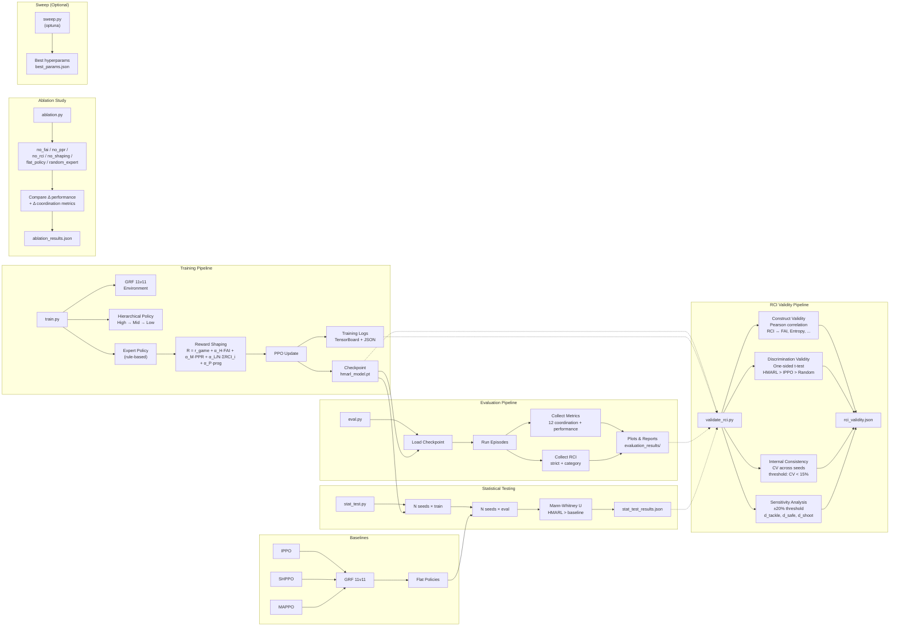

# HMARL-GRF

Hierarchical Multi-Agent Reinforcement Learning for Google Research Football.

Implements a three-level hierarchical RL architecture (High-Level → Mid-Level → Low-Level PPO) with novel Role Coherence Index (RCI) metric, plus three flat baselines (IPPO, SHPPO, MAPPO) for comparison.

## Project Structure

```
hmarl-grf/
├── hmarl/                        # Core package
│   ├── __init__.py
│   ├── env.py                    # GRF environment wrapper + state extraction
│   ├── utils.py                  # Shared utilities (seed, obs extraction, checkpointing, progress)
│   ├── policy.py                 # Hierarchical policy (High/Mid/Low-level)
│   ├── expert.py                 # Rule-based expert policy (RCI oracle)
│   ├── reward.py                 # Reward shaping (FAI, PPR, RCI, Ball Progression)
│   ├── rci.py                    # Role Coherence Index metric
│   ├── metrics.py                # Evaluation metrics suite
│   ├── ippo.py                   # Independent PPO baseline
│   ├── shppo.py                  # Shared PPO baseline (pooled experience)
│   └── mappo.py                  # MAPPO baseline (centralized critic)
├── scripts/
│   ├── train.py                  # HMARL training + checkpoint + mid-train eval
│   ├── eval.py                   # HMARL evaluation + visualization
│   ├── dry_run.py                # Dry run / smoke test (3-layer validation)
│   ├── calibrate_expert.py       # Expert threshold calibration (d_tackle, d_safe, d_shoot)
│   ├── diagnose_expert.py        # Expert policy behavioral diagnostic (action dist, passes, shots)
│   ├── probe4_windows.py         # Debug probe: possession-window action trace
│   ├── sweep.py                  # Optuna hyperparameter sweep
│   ├── stat_test.py              # Multi-seed statistical significance testing
│   ├── validate_rci.py              # RCI validity evaluation (construct, discrimination, consistency)
│   ├── ablation.py               # Ablation study (component contributions)
│   └── train_academy.py          # Simplified PPO for academy scenarios (no HMARL)
├── evaluation/
│   ├── baselines/                # Stable Baselines3 baselines
│   │   ├── 11v11_a2c.py
│   │   ├── 11v11_ppo.py
│   │   └── 11v11_random_action.py
│   ├── visualizations.py         # Plotting utilities (16 plot types, colorblind-safe)
│   ├── coordination_metrics.py   # Coordination metric computation
│   ├── plot_results.py           # Plot generation CLI (--demo mode)
│   └── average_position.py       # Average position analysis
├── dumps/                        # Episode dumps, replay, TensorBoard logs
│   ├── dump_to_txt.py
│   ├── dump_to_video.py
│   ├── convert_txt_to_json.py
│   └── replay.py
├── setup.py
└── README.md
```

## Research Workflow

Standard RL research pipeline — all paths relative to project root.


```mermaid
flowchart LR
    %% === TRAINING PIPELINE ===
    subgraph TRAIN["Training Pipeline"]
        direction TB
        A1["train.py"] --> A2["GRF 11v11<br/>Environment"]
        A1 --> A3["Hierarchical Policy<br/>High → Mid → Low"]
        A1 --> A4["Expert Policy<br/>(rule-based)"]
        A4 --> A5["Reward Shaping<br/>R = r_game + α_H·FAI + α_M·PPR + α_L/N·ΣRCI_i + α_P·prog"]
        A5 --> A6["PPO Update"]
        A6 --> A7["Checkpoint<br/>hmarl_model.pt"]
        A6 --> A8["Training Logs<br/>TensorBoard + JSON"]
    end

    %% === EVALUATION PIPELINE ===
    subgraph EVAL["Evaluation Pipeline"]
        direction TB
        B1["eval.py"] --> B2["Load Checkpoint"]
        B2 --> B3["Run Episodes"]
        B3 --> B4["Collect Metrics<br/>12 coordination + performance"]
        B3 --> B5["Collect RCI<br/>strict + category"]
        B4 --> B6["Plots & Reports<br/>evaluation_results/"]
        B5 --> B6
    end

    %% === VALIDATION PIPELINE ===
    subgraph VALID["RCI Validity Pipeline"]
        direction TB
        C1["validate_rci.py"] --> C2["Construct Validity<br/>Pearson correlation<br/>RCI ↔ FAI, Entropy, ..."]
        C1 --> C3["Discrimination Validity<br/>One-sided t-test<br/>HMARL > IPPO > Random"]
        C1 --> C4["Internal Consistency<br/>CV across seeds<br/>threshold: CV < 15%"]
        C1 --> C5["Sensitivity Analysis<br/>±20% threshold<br/>d_tackle, d_safe, d_shoot"]
        C2 --> C6["rci_validity.json"]
        C3 --> C6
        C4 --> C6
        C5 --> C6
    end

    %% === BASELINES ===
    subgraph BASE["Baselines"]
        direction TB
        D1["IPPO"] & D2["SHPPO"] & D3["MAPPO"] --> D4["GRF 11v11"]
        D4 --> D5["Flat Policies"]
    end

    %% === STAT & ABLATION ===
    subgraph STAT["Statistical Testing"]
        direction TB
        E1["stat_test.py"] --> E2["N seeds × train"]
        E2 --> E3["N seeds × eval"]
        E3 --> E4["Mann-Whitney U<br/>HMARL > baseline"]
        E4 --> E5["stat_test_results.json"]
    end

    subgraph ABLAT["Ablation Study"]
        direction TB
        F1["ablation.py"] --> F2["no_fai / no_ppr /<br/>no_rci / no_shaping /<br/>flat_policy / random_expert"]
        F2 --> F3["Compare Δ performance<br/>+ Δ coordination metrics"]
        F3 --> F4["ablation_results.json"]
    end

    subgraph SWEEP["Sweep (Optional)"]
        direction TB
        G1["sweep.py<br/>(optuna)"] --> G2["Best hyperparams<br/>best_params.json"]
    end

    %% === CROSS-CONNECTIONS ===
    A7 --> B2
    A7 --> E2
    D5 --> E3
    A7 -.-> C1
    A8 -.-> C1
    B6 -.-> C1
    E5 -.-> C1
```

### Research Execution Priority

Scripts categorized by whether they're required for thesis results. **Run Tier 1 first; Tier 2 depends on Tier 1 checkpoints.**

| Tier | Script | Purpose | Research Problem | Skip? |
|------|--------|---------|-----------------|-------|
| **0** | `dry_run.py --full` | Smoke test: syntax, imports, GRF env, PPO backward | — | 5 min, do once before any training |
| **0** | `diagnose_expert.py` | Expert behavioral diagnostic: action dist, pass rate, shots, heatmap | Understand WHY expert is not competitive | 5 min, run before fixing expert |
| **1** | `train.py` | Train HMARL (3M timesteps → checkpoint) | Foundation for all eval | No — produces `hmarl_model.pt` |
| **1** | `hmarl.ippo` / `hmarl.shppo` / `hmarl.mappo` | Train flat baselines | Need trained baselines for comparison | No — produces `*_model.pt` |
| **2** | `eval.py` | Full metrics + 16 plot types | All coordination + performance results | No |
| **2** | `ablation.py` | Component ablation (7 configs) | Rumusan 1: proving each component matters | No — `--quick` for first pass |
| **2** | `stat_test.py` | Multi-seed Mann-Whitney U | Statistical rigor for comparative claims | No — `--quick` for first pass |
| **2** | `validate_rci.py` | RCI construct + discrimination + consistency | Rumusan 2: RCI validity | No — needs `stat_test` results or `--seeds` |
| **3** | `sweep.py` | Optuna hyperparameter search | Optional optimization | **Yes** — hyperparams set via grid search already |
| **—** | `plot_results.py` | Regenerate plots from saved JSONs | Useful if `eval.py` plots need re-rendering | Optional, not research output |

**Minimum viable path for thesis results:**

```bash
# 1. Verify environment
docker compose up -d && docker exec -it gfootball-dev bash
python scripts/dry_run.py --full

# 1b. Diagnose expert policy (understand why it loses)
python scripts/diagnose_expert.py --episodes 5

# 2. Train (HMARL + baselines) — several days on GTX 1650
python scripts/train.py --timesteps 3000000
python -m hmarl.ippo --timesteps 3000000 --seed 42
python -m hmarl.shppo --timesteps 3000000 --seed 42
python -m hmarl.mappo --timesteps 3000000 --seed 42

# 3. Full evaluation (metrics + plots)
python scripts/eval.py --checkpoint checkpoints/hmarl_model.pt

# 4. Ablation (quick first, then full)
python scripts/ablation.py --quick
python scripts/ablation.py --timesteps 300000 --eval-episodes 50

# 5. Statistical testing (quick first, then full)
python scripts/stat_test.py --quick
python scripts/stat_test.py --seeds 5 --timesteps 3000000 --eval-episodes 100

# 6. RCI validity
python scripts/validate_rci.py --quick
python scripts/validate_rci.py --seeds 3 --timesteps 3000000 --eval-episodes 100
```

**Estimated compute time (GTX 1650, WSL):** 3–5 days per 3M-step training run. Ablation (7 configs × 300k) ≈ 1–2 days. Stat test (5 seeds × 4 algos × 3M) ≈ 2–3 weeks if sequential; overlap training to reduce wall time.

### Script → Module Dependency Matrix

| Script | utils | env | policy | expert | reward | rci | metrics |
|--------|:-----:|:---:|:------:|:------:|:------:|:---:|:-------:|
| `scripts/train.py` | ✅ | ✅ | ✅ | ✅ | ✅ | ✅ | ✅ |
| `scripts/eval.py` | ✅ | ✅ | ✅ | — | — | — | ✅ |
| `scripts/diagnose_expert.py` | ✅ | ✅ | ✅ | ✅ | — | — | — |
| `scripts/sweep.py` | ✅ | — | — | — | — | — | — |
| `scripts/stat_test.py` | ✅ | — | — | — | — | — | ✅ |
| `scripts/validate_rci.py` | ✅ | — | — | — | — | — | — |
| `scripts/ablation.py` | ✅ | ✅ | ✅ | ✅ | ✅ | ✅ | ✅ |
| `hmarl/ippo.py` | — | ✅ | — | — | — | — | — |
| `hmarl/shppo.py` | — | ✅ | — | — | — | — | — |
| `hmarl/mappo.py` | — | ✅ | — | — | — | — | — |

`sweep.py` and `stat_test.py` orchestrate training/eval as subprocesses — minimal hmarl imports (shared utilities only).

## Algorithms

### HMARL (Proposed Method)

Three-level hierarchical architecture:
- **High-Level** (π^H): Rule-based — global state → macro strategy (High Pressing / Counter Attack / Possession Play)
- **Mid-Level** (π^M): Rule-based — (role, macro strategy, local state) → sub-goal (Zonal Marking / Build-up / Wing Attack / Man Marking / Clearance)
- **Low-Level** (π^L): PPO-trained neural network — (observation, sub-goal embedding) → action

Combined reward: `R_t = r_game + α_H·FAI + α_M·PPR + (α_L/N)·Σ RCI_i + α_P·prog(t)`

### Baselines

| Algorithm | Actor | Critic | Experience | Reference |
|-----------|-------|--------|------------|-----------|
| **IPPO** | Shared (115-dim local obs) | Local (115-dim) | Per-agent, reward split evenly | Song et al. (2024) |
| **SHPPO** | Shared (115-dim local obs) | Local (115-dim) | Pooled, full team reward | Song et al. (2024) |
| **MAPPO** | Shared (115-dim local obs) | Centralized (1265-dim) | Pooled, full team reward | Yu et al. (2022) |

**Key differences:**
- **IPPO**: each agent's transition tracked independently; team reward divided equally (`r / 11`)
- **SHPPO**: all agents' transitions pooled into one buffer; full team reward assigned to every agent
- **MAPPO**: decentralized actors + centralized critic that sees concatenated observations of all 11 agents (11 × 115 = 1265-dim)

### Fairness Note

| Aspect | HMARL | IPPO | SHPPO | MAPPO |
|--------|-------|------|-------|-------|
| Learning rate | 3e-4 | 3e-4 | 3e-4 | 3e-4 |
| Discount (γ) | 0.99 | 0.99 | 0.99 | 0.99 |
| GAE lambda | 0.95 | 0.95 | 0.95 | 0.95 |
| Clip range | 0.2 | 0.2 | 0.2 | 0.2 |
| Entropy coeff | 0.01 | 0.01 | 0.01 | 0.01 |
| Value loss coeff | 0.5 | 0.5 | 0.5 | 0.5 |
| Minibatch size | 64 | 64 | 64 | 64 |
| PPO epochs | 4 | 4 | 4 | 4 |
| Total timesteps | 3M | 3M | 3M | 3M |
| Hidden dim | 256 | 256 | 256 | 256 |
| Network depth | 2 hidden | 2 hidden | 2 hidden | 2 hidden (actor + critic) |
| Optimizer | Adam (ε=1e-5) | Adam | Adam | Adam |
| Grad clip | 0.5 | 0.5 | 0.5 | 0.5 |
| Env representation | raw | raw | raw | raw |
| **Reward signal** | **r_game + FAI + PPR + RCI + prog** | r_game only | r_game only | r_game only |
| Seed support | ✅ | ✅ | ✅ | ✅ |
| CLI resume | ✅ | ✅ | ✅ | ✅ |
| Mid-train eval | ✅ | ✅ | ✅ | ✅ |

**Reward shaping difference (intentional):** HMARL uses hierarchical reward shaping (FAI, PPR, RCI, Ball Progression) while baselines use game reward only. This is a deliberate design choice: baselines represent standard flat RL without domain-specific reward engineering. HMARL's improvement over baselines is attributed to the combination of hierarchical architecture AND reward shaping. The ablation study (`scripts/ablation.py`) isolates each component's contribution.

## Expert Policy (Rule-Based Oracle)

`hmarl/expert.py` — role-based action selection used for reward shaping (RCI term) and RCI evaluation. Three levels: GK distribution logic, defender/midfielder/attacker branches per sub-goal.

**Ball-carrier decision ladder (fixed 2026-10-03):** the original implementation always returned `short_pass` for any carrier (pass-target check always found a teammate), producing pass-into-tackle turnover loops. Current logic:

1. Attacker in shooting range (`x > 0.5`, `dist_to_goal < max(d_shoot, 0.6)`) → shot
2. Heavy pressure (`min_opp_dist < 0.12`) → escape movement away from opponent, forward-biased
3. Safe window (`min_opp_dist < 0.25`) → short pass
4. Open space → advance toward attack

**Defensive logic:** defenders swarm-press the ball in own half (slide when `dist < 0.12`); clearance sub-goal closes down the ball directly. GK holds the shot line between ball and goal center, `0.06` in front of the goal line, and only leaves it for direct saves (`dist < 0.1`).

**Critical bug fixed (2026-10-03):** `_move_toward` had y-axis inverted — GRF `top` action moves **−y**, code mapped `dy > 0 → top`. Every diagonal/y movement in the expert was mirrored: defenders chased the wrong way, GK drifted off the line, escape vectors pointed backwards. This was the root cause of conceding 18–21 goals per episode before the fix.

**Status (10 episodes, `11_vs_11_stochastic`, seed 42, 3000 steps, CPU):** W/D/L = 0/0/10, WR 0%, GF/ep 0.2, GA/ep 5.5. Defense is workable after the y-fix (down from ~19 GA/ep); attack still cannot score consistently — known limitation, not yet addressed. The expert functions as a rule-based RCI oracle (role-consistent reference actions), not as a competitive player.

**Calibration (`scripts/calibrate_expert.py`):** collects per-timestep distance distributions and proposes thresholds as percentiles. Latest run (20 episodes): `d_tackle=0.5077` (p90 sliding-eligible), `d_safe=0.0700` (p10 space radius), `d_shoot=0.9969` (p10 goal distance). Note `--scenario` flag now actually reaches the env (previously ignored — always ran `11_vs_11_stochastic`); only 11v11 scenarios are supported since the policy stack hardcodes 11 agents.

**Important:** The calibrated thresholds differ substantially from the hardcoded heuristics used in the thesis (`d_tackle=0.05`, `d_safe=0.15`, `d_shoot=0.30`). The calibrated values suggest that distance distributions in 11v11 stochastic scenarios have different characteristics than assumed. The hardcoded heuristics are retained for consistency with the thesis design, and sensitivity analysis is used to evaluate robustness to threshold variations. See `scripts/calibrate_expert.py` for the full calibration pipeline.

**Diagnostic (`scripts/diagnose_expert.py`):** runs expert policy against GRF bot and collects detailed behavioral data: action distribution per role, ball possession time, pass attempts/completions, shots on target, conceded positions, ball heatmap (3×3 grid), and strategy/sub-goal activation frequency. Run this before attempting to fix expert policy — it reveals WHERE the expert fails (e.g., "attack never enters attacking third", "passes completion rate < 5%", "CF rarely receives ball").

```bash
python scripts/diagnose_expert.py --episodes 5 --output evaluation_results/expert_diagnostics.json
```

## Known Issues & Root Cause Analysis (2026-10-04)

### Issue 1: Expert Policy Not Competitive (WR 0%)

**Symptom:** Expert policy achieves W/D/L = 0/0/10 against GRF bot difficulty 1.0. GF/ep = 0.2, GA/ep = 5.5.

**Root cause:** Expert policy implements *positioning rules* (defenders between ball and goal, GK on shot line, midfielders adjusting to ball position) but lacks *scoring mechanisms*: no through-balls, no off-the-ball runs, no combination play. Positioning ≠ goal scoring.

**Impact on thesis:** RCI measures conformity to a non-competitive reference. The ground-truth validity check (BAB_4: expert must achieve WR > 50%) fails.

**Mitigation:** Run `diagnose_expert.py` to identify specific failure points before attempting to fix attack logic.

### Issue 2: PPR Always 0 or 100

**Symptom:** `episode_ppr` in training log shows 0.0 for most episodes, with occasional 100.0 spikes.

**Root cause:** Team rarely completes passes (WR 0% = constant possession loss). When `successful_passes ≈ 0`, PPR = 0/0 = 0. When 1 pass succeeds and it happens to be progressive, PPR = 100.

**Fix applied (2026-10-04):** `PassTracker._pass_start_pos` bug fixed in `hmarl/reward.py`. Previously, when ball went loose (`ball_owned_player = -1`) and was recovered by a teammate, `_pass_start_pos` was set to the receiver's position (not the previous possessor's), causing progressive check to compare a player's position against itself → always non-progressive. Now `_pass_start_pos` correctly tracks the pass initiator's position.

**Diagnostics added:** Training log now records `episode_pass_attempts`, `episode_pass_successful`, `episode_pass_progressive` to distinguish computational bugs from behavioral failures.

### Issue 3: RCI_strict ≈ Random (0.05 ≈ 1/19)

**Symptom:** `episode_rci_strict` hovers around 0.04–0.06, statistically indistinguishable from random (1/19 ≈ 0.053 for 19 discrete actions).

**Root cause:** Reward shaping uses `f_cat` (category match), not `f_strict`. No gradient signal for exact action matching. RCI contribution per agent: 0.05 × 0.47 / 11 ≈ 0.0022/step — negligible compared to entropy coefficient (0.01) and FAI contribution (0.083/step).

**Implication:** RCI_strict cannot be used as evidence that agents learn exact expert actions. RCI_cat (~0.47) is the meaningful metric, but it's inflated by movement category dominance (8 of 19 actions = movement). An rci_nomove diagnostic variant (movement matches earn zero) was added 2026-10-06 to quantify this inflation directly — see "RCI Validity Evaluation" below.

### Issue 6: RCI-Entropy/Compactness Correlations Have Wrong Sign (2026-10-06)

**Symptom:** Post-fix validation run showed rci_cat ↔ positional_entropy r=+0.923 and rci_cat ↔ compactness_mean r=+0.898 — both strongly POSITIVE, both expected NEGATIVE ("coherent team = tighter formation").

**Root cause hypothesis:** movement-volume confound. Movement actions (8/19) dominate both rci_cat (as a large easy-match base) and both spread metrics (more movement → more zones visited → higher entropy; more wandering → larger centroid RMS → higher compactness ρ). One latent factor may drive all three.

**Test:** `rci_nomove` — if its entropy/compactness correlations flip negative, the confound hypothesis holds; if they stay positive, the "coherent = compact" intuition itself is wrong. Discrimination vs random passed (p=0.022) in the same run, and rci_cat ↔ FAI r=0.906 confirms low novelty (redundancy RED threshold >0.8).

### Issue 4: Reward Dominated by Shaping (~99%)

**Symptom:** Episode rewards range 160–570. Game reward (goals ±1) contributes ~2–4. Shaping (FAI + RCI + prog) contributes ~350–380.

**Root cause:** α_H·FAI × T = 0.1 × 0.83 × 3000 ≈ 249. α_L·RCI × T = 0.05 × 0.47 × 3000 ≈ 71. α_P·prog × T ≈ 45. Game reward: ±2–4.

**Implication:** Agent learns to maximize shaping reward (positioning + category match) while ignoring game reward (winning). This creates a local optimum: "coherent but non-competitive." FAI = 0.83 from episode 1 (rule-based positioning), RCI_cat = 0.47 (moderate category match), WR = 0% (no goals).

### Issue 5: Calibration Mismatch

**Symptom:** Hardcoded thresholds (0.05/0.15/0.30) differ substantially from calibrated values (0.51/0.07/1.00).

**Root cause:** Distance distributions in 11v11 stochastic scenarios differ from manual assumptions. Calibrated `d_shoot = 1.00` (p10 goal distance) suggests ball carriers are rarely close to goal; `d_tackle = 0.51` (p90 sliding-eligible) suggests defenders engage opponents at larger distances than assumed.

**Mitigation:** Hardcoded heuristics retained for thesis consistency. Sensitivity analysis (±20% variation) evaluates robustness. Calibrated values reported as input for sensitivity analysis.

## Environment

Google Research Football (`11_vs_11_stochastic`), 11 controlled agents, 19 discrete actions.

**Academy scenarios** (simplified, for ablation/debugging): `academy_single_goal_versus_lazy` (4 agents), `academy_empty_goal` (4), `academy_run_to_score` (1), `academy_run_to_score_with_keeper` (1), `academy_3_vs_1_with_keeper` (3). Use `train_academy.py` for these — the full HMARL pipeline (FAI/RCI/expert) is designed for 11v11 only.

Two observation modes:
- `raw` — dict per agent (used by HMARL, IPPO, SHPPO, MAPPO for full state access)
- `simple115v2` — 115-dim vector per agent (used by Stable Baselines3 baselines)

## Requirements

**Core (required):**
- Python 3.6+
- PyTorch
- NumPy
- Google Research Football (Docker only)

**Baselines:**
- Stable Baselines3 (for `evaluation/baselines/` scripts)

**Optional (for advanced analysis):**
- `optuna` — hyperparameter sweep (`scripts/sweep.py`)
- `scipy` — statistical significance tests (`scripts/stat_test.py`)

## Setup

### Google Research Football (GRF) Installation

GRF requires building from source — it has no pre-built packages for Windows. Docker is the supported approach.

**Option A: Docker (recommended)**

```bash
# 1. Clone GRF into a temporary directory (needed for Docker build)
git clone https://github.com/google-research/football.git /tmp/grf

# 2. Copy GRF source into this project (Dockerfile expects it at project root)
cp -r /tmp/grf/. .

# 3. Build and start the container (installs GRF + dependencies)
docker compose up -d

# 4. Enter the container
docker exec -it gfootball-dev bash

# 5. Install this package (inside container)
cd /gfootball
pip install -e .

# 6. Optional: install analysis tools
pip install optuna scipy
```

**Option B: Native (Linux only, no Docker)**

```bash
# 1. Install system dependencies
sudo apt-get install -y git cmake build-essential \
    libgl1-mesa-dev libsdl2-dev libsdl2-image-dev \
    libsdl2-ttf-dev libsdl2-gfx-dev libboost-all-dev \
    libdirectfb-dev

# 2. Clone and build GRF
git clone https://github.com/google-research/football.git
cd football
pip install .
cd ..

# 3. Install this package
pip install -e .
```

**Note:** GRF does not support native Windows installation. Windows users must use Docker. WSL2 + Docker Desktop is the recommended path.

## Training

### HMARL (Proposed)

```bash
python scripts/train.py --timesteps 3000000

# With custom seed for reproducibility
python scripts/train.py --timesteps 3000000 --seed 123

# Resume from checkpoint
python scripts/train.py --resume checkpoints/hmarl_model.pt

# Custom log/checkpoint directory
python scripts/train.py --log-dir my_logs --model-dir my_checkpoints

# Selective dump: save episode dumps every 500 episodes (keeps max 10)
python scripts/train.py --dump-freq 500 --max-dumps 10

# Dump more frequently for presentation material
python scripts/train.py --dump-freq 100 --max-dumps 20

# Disable dumps entirely
python scripts/train.py --dump-freq 0
```

**Mid-training evaluation:** Automatically runs 10-episode evaluation every 500 episodes, logging win rate, avg reward, and goal difference to TensorBoard.

**Training log:** Per-episode metrics saved to `dumps/training_log.json` (rewards, RCI, FAI, PPR, compactness, ball progression, action distribution, pass diagnostics).

**PPR diagnostics (added 2026-10-04):** Training log now includes per-episode pass tracking: `episode_pass_attempts`, `episode_pass_successful`, `episode_pass_progressive`. These diagnostics reveal whether PPR = 0 is caused by computation bugs or by the team genuinely failing to complete passes. If `pass_successful` ≈ 0 across episodes, the issue is behavioral (agents can't pass), not computational.

**Scenario support (added 2026-10-05):** `train.py` now accepts `--scenario` to run on different GRF scenarios (e.g., `academy_single_goal_versus_lazy`). The trainer auto-adjusts `num_agents` and env name. Note: FAI/RCI/expert are designed for 11v11 — academy scenarios may produce meaningless shaping values.

### Academy Scenarios (Simplified PPO)

`scripts/train_academy.py` — stripped-down PPO trainer **without** HMARL hierarchy (no FAI, RCI, PPR, expert, or hierarchical controller). Pure game reward + configurable goal bonus. Purpose: test whether the PPO network can learn to score goals at all in easy scenarios.

```bash
# Test scoring ability on lazy defenders (4 agents)
python scripts/train_academy.py --scenario academy_single_goal_versus_lazy --timesteps 100000

# Empty goal (easiest — no keeper)
python scripts/train_academy.py --scenario academy_empty_goal --timesteps 50000

# Single agent scoring scenarios
python scripts/train_academy.py --scenario academy_run_to_score --timesteps 50000
python scripts/train_academy.py --scenario academy_run_to_score_with_keeper --timesteps 100000

# Custom goal bonus and output directory
python scripts/train_academy.py --scenario academy_3_vs_1_with_keeper \
    --timesteps 200000 --goal-bonus 20.0 --log-dir dumps_3v1
```

**Interpretation:**
- GF > 0 and increasing → PPO can score; HMARL shaping is the bottleneck
- GF = 0 throughout → PPO hyperparams or obs encoding is broken
- Training log saved to `<log-dir>/training_log.json`, model to `<log-dir>/academy_model.pt`

## TensorBoard Monitoring

TensorBoard logs are written to `dumps/hmarl_runs/` by `train.py`.

**Logged metrics:**

| Tag | Frequency | Description |
|-----|-----------|-------------|
| `loss/policy` | Per PPO update | Clipped surrogate policy loss |
| `loss/value` | Per PPO update | Value function MSE loss |
| `loss/entropy` | Per PPO update | Policy entropy bonus |
| `reward/episode` | Per episode | Cumulative reward per episode |
| `reward/avg_100` | Per episode | Rolling 100-episode average reward |
| `training/episode_length` | Per episode | Timesteps per episode |
| `eval/win_rate` | Every 500 episodes | Win rate during mid-training eval |
| `eval/avg_reward` | Every 500 episodes | Average reward during mid-training eval |
| `eval/goal_diff` | Every 500 episodes | Goal difference during mid-training eval |
| `metrics/rci_cat` | Every 50 episodes | Rolling RCI_cat average |
| `metrics/rci_strict` | Every 50 episodes | Rolling RCI_strict average |
| `metrics/fai` | Every 50 episodes | Rolling FAI average |
| `metrics/ppr` | Every 50 episodes | Rolling PPR average |
| `metrics/compactness` | Every 50 episodes | Rolling compactness average |

**Access from host:**
```bash
pip install tensorboard
cd C:/1_projects/UGM/tesis/proposal/Source Code/hmarl-grf
tensorboard --logdir=dumps/hmarl_runs
# Open http://localhost:6006
```

**Access from container:**
```bash
docker exec -it gfootball-dev bash
tensorboard --logdir=/gfootball/dumps/hmarl_runs --host=0.0.0.0
# Open http://localhost:6006
```

Note: If `tensorboard` is not installed on the host, use the container method. The `dumps/` directory is bind-mounted, so logs written inside the container are accessible from both host and container.

**Episode dumps:** GRF can write full episode dumps (`.dump` files) for replay and visualization. These are large (~12MB per episode), so training uses **selective dumping** — dumps are only written at specific intervals and auto-cleaned to keep storage bounded. See [Episode Dumps](#episode-dumps) for details.

### Baselines

```bash
# IPPO (per-agent independent PPO)
python -m hmarl.ippo --timesteps 3000000 --seed 42

# SHPPO (shared network, pooled experience)
python -m hmarl.shppo --timesteps 3000000 --seed 42

# MAPPO (decentralized actors + centralized critic)
python -m hmarl.mappo --timesteps 3000000 --seed 42

# Resume from checkpoint
python -m hmarl.ippo --resume dumps/ippo_model.pt
python -m hmarl.shppo --resume dumps/shppo_model.pt
python -m hmarl.mappo --resume dumps/mappo_model.pt
```

All baselines support `--seed` and `--resume` flags (same as HMARL).

## Evaluation

```bash
# Evaluate HMARL + random baseline
python scripts/eval.py --checkpoint checkpoints/hmarl_model.pt --baseline all

# Evaluate HMARL only (100 episodes)
python scripts/eval.py --checkpoint checkpoints/hmarl_model.pt --episodes 100

# With rendering
python scripts/eval.py --checkpoint checkpoints/hmarl_model.pt --render
```

**Checkpoint metadata:** When loading a checkpoint, `eval.py` displays reproducibility info: git hash, training hyperparameters, Python/Torch versions, and training timestamp (saved by `train.py` since the refactoring).

**Metrics computed:**
- **Performance**: Win Rate, Goal Difference, Cumulative Reward
- **Coordination**: PSR, PPR, Positional Entropy, Team Compactness, FAI
- **Role Coherence**: RCI_strict (exact match), RCI_cat (category match), RCI_nomove (category match, movement excluded — diagnostic)
- **Action Analysis**: Action distribution, entropy, dominant action % (mode collapse detection)

**Output files:**
- `evaluation_results/hmarl_results.json` — aggregate metrics + action distribution
- `evaluation_results/hmarl_episodes.json` — per-episode breakdown
- `evaluation_results/reward_components.json` — per-episode reward breakdown (game, FAI, PPR, RCI, progression)
- `evaluation_results/plots/` — role heatmap, formation snapshots, action distribution, strategy timeline, compactness plot

## Dry Run (Smoke Test)

Three-layer validation to catch issues before full training runs.

| Layer | What it tests | Needs Docker? |
|-------|---------------|---------------|
| 1 | AST syntax check on all `.py` files | No |
| 2 | Import all modules + unit tests (policy, reward, metrics, buffer) | Yes |
| 2c | Script unit tests (eval, validate_rci, stat_test, ablation, sweep) | Yes |
| 3 | Full GRF integration: 1 episode, 50 steps, PPO backward pass | Yes |

```bash
# Quick: AST + components + mock pipeline (no GRF env)
python scripts/dry_run.py

# Full: includes actual GRF environment (50 steps)
python scripts/dry_run.py --full

# Host-only: syntax check only (no imports, no Docker)
python scripts/dry_run.py --ast-only
```

**What it verifies:**
- All `.py` files parse without syntax errors
- All `hmarl.*` modules import successfully
- Policy forward/backward pass with correct shapes
- Observation vector extraction (115-dim)
- High/Mid-level policy logic (strategy + sub-goal)
- Expert policy ideal actions per role
- Reward computation (FAI + PPR + RCI + Ball Progression)
- Rollout buffer (add, GAE, mini-batch)
- Action category mapping
- Mock training loop: 50 steps, full PPO update
- Script function tests: eval obs extraction, validate_rci correlation/t-test/CV, stat_test Mann-Whitney U, ablation reward factory, sweep optuna availability

**Example output:**
```
=== Layer 1: AST Syntax Check ===
  All .py files parse OK

=== Layer 2: Component Unit Tests ===
  PASS  import all modules
  PASS  set_seed
  PASS  policy forward pass
  PASS  policy backward pass
  PASS  extract_obs_vector
  PASS  extract_game_state
  PASS  high-level policy
  PASS  mid-level policy
  PASS  expert policy
  PASS  reward computation
  PASS  FAI computation
  PASS  RCI computation
  PASS  metrics
  PASS  team_compactness
  PASS  formation_adherence_index (metric)
  PASS  rollout buffer
  PASS  action category

=== Layer 2b: Mock Pipeline (1 episode, 50 steps) ===
    step 10/50 reward=0.342
    step 20/50 reward=0.891
    step 30/50 reward=1.456
    step 40/50 reward=2.012
    step 50/50 reward=2.678
  PASS  PPO backward update (mock pipeline)
  Mock pipeline: 50 steps in 1.23s (41 steps/s)

=== Layer 2c: Script Unit Tests ===
  PASS  eval._extract_dict_from_simple
  PASS  eval.get_obs_vector
  PASS  validate_rci.construct_validity
  PASS  validate_rci.discrimination_validity
  PASS  validate_rci.internal_consistency
  PASS  validate_rci.run_full_validation
  PASS  stat_test.run_statistical_test
  PASS  sweep imports
  PASS  ablation.make_custom_reward
  PASS  ablation.ABLATION_CONFIGS

=== Layer 3: GRF Integration (1 episode, 50 steps) ===
  PASS  env.reset + extract_game_state
  PASS  env.step full loop (50 steps)
  PASS  GRF PPO backward (10 steps)

============================================================
  ALL 30 CHECKS PASSED
============================================================
```

## Plot Generation

Generate all 16 thesis plots from saved evaluation results, or with synthetic data for visual verification.

```bash
# Demo mode: generate all plots with synthetic data (no training needed)
python evaluation/plot_results.py --demo --output-dir plots_output

# From real evaluation results
python evaluation/plot_results.py --results-dir evaluation_results --output-dir evaluation_results/plots

# Docker
docker exec gfootball-dev bash -c "cd /app && python3 evaluation/plot_results.py --demo --output-dir /app/evaluation_results/plots"
docker cp gfootball-dev:/app/evaluation_results/plots/ ./plots_output/
```

**16 plot types:**

| # | Plot | File | Description |
|---|------|------|-------------|
| 1 | Learning Curve | `01_learning_curve.png` | Cumulative reward vs episode (rolling mean ± std band) |
| 2 | RCI Evolution | `02_rci_evolution.png` | RCI_cat (a) and RCI_strict (b) over training — two-panel with subplot labels |
| 3 | Comparative Bars | `03_comparative_metrics.png` | Two-panel: (a) Performance, (b) Coordination (normalized to [0,1]) |
| 4 | Role Heatmap | `04_role_heatmap.png` | 2D position frequency per role on pitch (hot colormap) |
| 5 | Formation Snapshot | `05_formation_*.png` | Agent positions at specific timestep (start/mid/late) |
| 6 | Action Distribution | `06_action_distribution.png` | Stacked bar: action category per role |
| 7 | Strategy Timeline | `07_strategy_timeline.png` | Macro strategy activation over match (single or multi-episode) |
| 8 | Compactness | `08_compactness.png` | Team compactness ρ_tc over time (multi-episode: mean ± std) |
| 9 | Ablation Study | `09_ablation.png` | Horizontal bars sorted by value, Full HMARL highlighted, reference line |
| 10 | Tactic Transitions | `10_tactic_transitions.png` | Sub-goal frequency stacked area (single or multi-episode) |
| 11 | Reward Breakdown | `11_reward_breakdown.png` | Reward component contribution over training |
| 12 | Correlation Heatmap | `12_correlation_heatmap.png` | Pearson r between coordination metrics |
| 13 | Pass Network | `13_pass_network.png` | Weighted directed graph of pass connections between players |
| 14 | Inter-Agent Distance | `14_iad_per_line.png` | Bar chart: gaps between defence/midfield/attack lines |
| 15 | Convex Hull | `15_convex_hull_ts.png` | Convex hull area over match duration |
| 16 | Action Transitions | `16_action_transitions.png` | Action-to-action transition probability heatmap (viridis) |

**Plot design:**
- **Colorblind-safe palette**: Wong (2011) — all 5 methods distinguishable by color, linestyle, AND marker (triple encoding)
- **Stable mapping**: HMARL = blue, SHPPO = vermillion, MAPPO = pink, IPPO = green, Random = gray — consistent across all figures
- **Subplot labels**: Multi-panel figures use (a), (b) labels for thesis cross-referencing
- **No figure titles**: Thesis convention — `\caption{}` serves as title
- **300 DPI**, serif font, Computer Modern math rendering, no seaborn dependency

## Hyperparameter Sweep

Searches over 8 hyperparameters using Optuna TPE sampler with median pruner.

**Search space:**

| Parameter | Range |
|-----------|-------|
| Learning rate | 1e-5 — 1e-2 (log) |
| Discount (γ) | 0.95 — 0.999 |
| GAE lambda (λ) | 0.8 — 0.99 |
| Clip range (ε) | 0.1 — 0.3 |
| Entropy coeff | 1e-4 — 0.1 (log) |
| Value loss coeff | 0.25 — 1.0 |
| Minibatch size | {32, 64, 128} |
| PPO epochs | 2 — 8 |

```bash
# 50 trials, 500k steps each
python scripts/sweep.py --trials 50 --timesteps 500000

# Quick scan
python scripts/sweep.py --trials 20 --timesteps 100000

# Custom output path
python scripts/sweep.py --output my_sweep/best.json
```

**Output:** `sweep_results/best_params.json`

**Temp cleanup:** `sweep_temp/` directory cleaned up after completion.

## Statistical Significance Testing

Runs each algorithm over N random seeds, computes mean ± std, and performs Mann-Whitney U test (one-sided: HMARL > baseline, α = 0.05).

```bash
# Full: 5 seeds, 3M steps, 100 eval episodes
python scripts/stat_test.py --seeds 5 --timesteps 3000000 --eval-episodes 100

# Quick: 3 seeds, 100k steps, 10 eval episodes
python scripts/stat_test.py --quick

# Test specific algorithms
python scripts/stat_test.py --algorithms hmarl ippo shppo mappo random

# Custom base seed
python scripts/stat_test.py --seeds 5 --base-seed 100
```

**Output:** `evaluation_results/stat_test_results.json`

**Flat baseline metrics:** All algorithms (including IPPO, SHPPO, MAPPO, Random) now compute the full metrics suite (RCI, PSR, PPR, FAI, compactness, entropy, etc.) — not just win rate and reward. This enables apple-to-apple comparison across all metrics.

**Progress tracking:** Displays live progress bar with ETA during seed loops and episode evaluation.

**Temp cleanup:** Temporary directories (`stat_temp/`) are automatically cleaned up after completion.

**Statistical tests performed:**
- Mann-Whitney U test (one-sided, HMARL > each baseline)
- Reports: U-statistic, p-value, significance (p < 0.05)
- Gracefully skips if scipy not installed

## RCI Validity Evaluation

Evaluates Role Coherence Index (RCI) through three validity approaches matching the thesis methodology (BAB IV §Validitas Metrik RCI):

1. **Construct Validity** — Pearson correlation between RCI and established metrics (FAI, Entropy, Compactness, PSR, PPR) with p-values
2. **Discrimination Validity** — One-sided t-test: HMARL RCI > IPPO RCI > Random RCI (α = 0.05)
3. **Internal Consistency** — Coefficient of Variation (CV) across seeds; CV < 15% = acceptable
4. **Sensitivity Analysis** (optional) — RCI stability under expert policy threshold variations (±20% on d_tackle, d_safe, d_shoot)

```bash
# Full: 3 seeds, 3M steps, 100 eval episodes
python scripts/validate_rci.py --seeds 3 --timesteps 3000000 --eval-episodes 100

# Quick: 3 seeds, 100k steps, 10 eval episodes
python scripts/validate_rci.py --quick

# Load existing stat_test results (seed-level aggregates only)
python scripts/validate_rci.py --load-results evaluation_results/stat_test_results.json

# Include sensitivity analysis (requires trained model checkpoint)
python scripts/validate_rci.py --sensitivity --model-path dumps/hmarl_model.pt

# Test specific algorithms
python scripts/validate_rci.py --algorithms hmarl ippo shppo random
```

**Output:** `evaluation_results/rci_validity.json`

**Error handling:** Full tracebacks on failure (not just error messages). Imports consolidated to `hmarl.utils` (no more cross-script circular imports). Format string safety for missing metrics. Handles skipped tests (e.g., insufficient seeds) without KeyError.

**Dependencies:** `scipy` (for t-test and Pearson correlation). Skips gracefully if not installed.

**Correlation pairs tested:**
- RCI_cat ↔ FAI (expected: positive)
- RCI_strict ↔ FAI (expected: positive)
- RCI_cat ↔ Positional Entropy (expected: negative)
- RCI_strict ↔ Positional Entropy (expected: negative)
- RCI_cat ↔ Compactness (expected: negative)
- RCI_cat ↔ PSR/PPR/Win Rate (expected: positive)
- **Confound test (added 2026-10-06):** RCI_nomove ↔ FAI/Entropy/Compactness/PSR/Win Rate (same expected directions)

**RCI_nomove (movement-confound diagnostic, added 2026-10-06):** A diagnostic RCI variant where movement-vs-movement matches earn zero (`f_category_nomove` in `hmarl/rci.py`). Motivation: validation runs showed `rci_cat` correlating ~+0.9 with positional entropy and compactness, both expected NEGATIVE. Since movement dominates (8 of 19 actions) and drives both entropy and compactness upward, that correlation may be an artefact of movement volume rather than role coherence. `rci_nomove` is exposed through `compute_rci()` / `compute_all_metrics()` and collected per seed by `validate_rci.py`.

Interpretation of the confound test:
- rci_nomove↔entropy/compactness **flips negative** → prior positive correlations were a movement artefact; use rci_nomove (or correct expectations) in BAB_4
- **stays positive** → real relationship opposing "coherent = compact" intuition; hypothesis needs rewording
- **≈0 / not significant** → RCI captures a different movement-volume dimension; weak link to spread either way

**Note on `--load-results`:** pre-computed result files from before 2026-10-06 do not contain `rci_nomove` — re-run training/evaluation (not just the correlation step) to get confound-test results.

## Ablation Study

Tests contribution of each component by systematically removing them:

| Config | Description | What changes |
|--------|-------------|--------------|
| `full_hmarl` | Full HMARL (baseline) | Nothing — all components active |
| `no_fai` | Without FAI reward | α_H = 0, no formation adherence signal |
| `no_ppr` | Without PPR reward | α_M = 0, no progressive pass signal |
| `no_rci` | Without RCI reward | α_L = 0, no role coherence signal |
| `no_reward_shaping` | Game reward only | All α = 0, pure game reward |
| `flat_policy` | Flat policy | Sub-goal embedding zeroed out, no hierarchical conditioning |
| `random_expert` | Random expert | Ideal actions random instead of rule-based |

```bash
# Full ablation (all 7 configs)
python scripts/ablation.py --timesteps 300000 --eval-episodes 50

# Quick mode (100k steps, 20 eval episodes)
python scripts/ablation.py --quick

# Run specific configs only
python scripts/ablation.py --configs full_hmarl no_fai no_rci

# Custom seed
python scripts/ablation.py --seed 123 --timesteps 500000
```

**Output:** `evaluation_results/ablation_results.json`

**Progress tracking:** Live progress bar with ETA for the 7-config loop. Error tracebacks on failure.

**Temp cleanup:** `ablation_temp/` directory cleaned up after completion.

**Summary table example:**
```
  Config                     Win Rate   Avg Reward   Goal Diff
  ---------------------------------------------------------
  full_hmarl                   45.0%        12.34          5
  no_fai                       38.0%        10.21          2  (-7.0%)
  no_ppr                       40.0%        11.05          3  (-5.0%)
  no_rci                       35.0%         9.87          0  (-10.0%)
  no_reward_shaping            30.0%         8.45         -2  (-15.0%)
  flat_policy                  25.0%         7.12         -5  (-20.0%)
  random_expert                42.0%        11.50          4  (-3.0%)
```

## Hyperparameters

| Parameter | Value |
|-----------|-------|
| Learning rate | 3e-4 |
| Discount (γ) | 0.99 |
| GAE lambda (λ) | 0.95 |
| Clip range (ε) | 0.2 |
| Entropy coeff (c2) | 0.01 |
| Value loss coeff (c1) | 0.5 |
| Minibatch size | 64 |
| PPO epochs per update | 4 |
| Total timesteps | 3,000,000 |
| Max episode steps | 3,000 |
| Hidden dim | 256 |
| Head dim | 128 |
| Sub-goal embedding dim | 16 |
| Random seed | 42 (default) |

## Reward Shaping Coefficients

| Coefficient | Component | Value | Description |
|-------------|-----------|-------|-------------|
| α_H | Formation Adherence Index (FAI) | 0.1 | High-level formation adherence signal |
| α_M | Progressive Pass Ratio (PPR) | 0.1 | Mid-level progressive passing signal |
| α_L | Role Coherence Index (RCI) | 0.05 | Low-level role coherence signal |
| α_P | Ball Progression | 0.2 | Dense forward-progress reward |

**Rationale:** Coefficients are scaled so that shaping terms contribute ~0.1–0.3 per step (meaningful gradient signal), while the game reward contributes ~-5 to -10 per step (sparse, only on goals). The ball progression term (α_P = 0.2) provides the strongest dense signal to prevent the agent from collapsing into inaction when no goals are scored.

## CLI Reference

### Shared Utilities (`hmarl/utils.py`)

Central module eliminating code duplication across scripts. All scripts import from this module instead of defining local copies.

| Export | Description |
|--------|-------------|
| `set_seed(seed)` | Set random seeds (Python, NumPy, PyTorch) |
| `extract_obs_vector(gs, idx, obs_dim=115)` | Extract fixed-length observation vector from GRF game state |
| `load_hmarl_checkpoint(path, device)` | Load policy + subgoal_embedding + metadata from checkpoint |
| `save_checkpoint(path, ...)` | Save checkpoint with reproducibility metadata (git hash, hyperparams, timestamps) |
| `ProgressTracker(total, label)` | Live progress bar + ETA for loops |
| `cleanup_temp_dirs(dirs)` | Remove temporary directories (`stat_temp/`, `ablation_temp/`, etc.) |
| `get_git_hash()` | Best-effort git commit hash |
| `OBS_DIM`, `HIDDEN_DIM`, `HEAD_DIM`, `ACTION_SPACE_SIZE`, `EPISODE_MAX_STEPS` | Shared constants (single source of truth) |

### Reproducibility Metadata

Checkpoints saved by `train.py` include:
- `git_hash` — commit hash at training time
- `python_version`, `torch_version` — runtime environment
- `save_timestamp` — when the checkpoint was saved
- `hyperparams` — all PPO hyperparameters used for training

This metadata is displayed by `eval.py` when loading a checkpoint and stored in the JSON output.

### train.py

```
--timesteps INT     Total training timesteps (default: 3,000,000)
--eval-freq INT     Evaluation frequency in episodes (default: 10,000)
--seed INT          Random seed (default: 42)
--resume PATH       Resume from checkpoint
--render            Render during training
--log-dir PATH      Log directory (default: dumps)
--model-dir PATH    Checkpoint directory (default: checkpoints)
--dump-freq INT     Enable dump every N episodes (default: 500, 0=never)
--max-dumps INT     Max dump files to keep (default: 10)
--scenario STR      GRF scenario (default: 11_vs_11_stochastic)
```

### train_academy.py

```
--scenario STR      GRF academy scenario (default: academy_single_goal_versus_lazy)
--timesteps INT     Total training timesteps (default: 100,000)
--log-dir PATH      Log/output directory (default: dumps_academy)
--seed INT          Random seed (default: 42)
--render            Render during training
--goal-bonus FLOAT  Extra reward per goal scored (default: 10.0)
```

### eval.py

```
--checkpoint PATH   Model checkpoint path (required)
--episodes INT      Number of evaluation episodes (default: 100)
--output-dir PATH   Output directory (default: evaluation_results)
--render            Render during evaluation
--baseline STR      Also eval baselines: "random" or "all"
```

### sweep.py

```
--trials INT        Number of Optuna trials (default: 50)
--timesteps INT     Training steps per trial (default: 500,000)
--eval-episodes INT Eval episodes per trial (default: 20)
--seed INT          Base seed (default: 42)
--study-name STR    Optuna study name (default: hmarl_sweep)
--output PATH       Output JSON path
```

### stat_test.py

```
--seeds INT         Number of random seeds (default: 5)
--timesteps INT     Training steps per seed (default: 3,000,000)
--eval-episodes INT Eval episodes per seed (default: 100)
--base-seed INT     Starting seed (default: 42)
--algorithms LIST   Algorithms to test (default: hmarl random)
--output PATH       Output JSON path
--quick             Quick mode: 100k steps, 10 eval, 3 seeds
```

### ablation.py

```
--timesteps INT     Training steps per config (default: 300,000)
--eval-episodes INT Eval episodes per config (default: 50)
--seed INT          Random seed (default: 42)
--configs LIST      Specific configs to run (default: all 8)
--output PATH       Output JSON path
--quick             Quick mode: 100k steps, 20 eval episodes
```

## Episode Dumps

GRF's `write_full_episode_dumps=True` writes a `.dump` file (~12MB) for **every episode**. With 3M timesteps (~6,000 episodes), that's ~72GB — impractical for storage.

**Strategy: selective dump + auto-cleanup**

| Constant | Default | Effect |
|----------|---------|--------|
| `DUMP_FREQ` | 500 | Enable dump every N episodes |
| `MAX_DUMPS` | 10 | Keep at most N most recent dump files |

During training:
1. Normal episodes → `write_full_episode_dumps=False` (no disk write)
2. Every `DUMP_FREQ` episodes → env recreated with `write_full_episode_dumps=True` for 1 episode
3. After the dump episode → env reverts to `False`, old dumps beyond `MAX_DUMPS` are deleted

**Storage estimate:**
- 10 dumps × ~12MB = **~120MB** (stable, does not grow with training)
vs
- Without selective dump: 6,000 episodes × ~12MB = **~72GB**

**Replay & visualization:**
```bash
# Replay a dump file
python dumps/replay.py --trace_file dumps/episode_done_XXXX.dump

# Convert dump to JSON for analysis
python dumps/convert_txt_to_json.py dumps/episode_done_XXXX.dump output.json
```

## License

Internal research use only.
